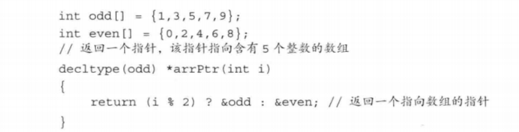

# CppPrimer注意事项

[TOC]

## 第一部分 基本语言

### 第六章 函数

#### 6.2 参数传递

**main：处理命令行选项**

```
int main ( int argc,  char *argv[] )
从argv[1]开始
```

**含有可变形参的函数**

两种方法： 

* 所有实参类型相同： `initializer_list`
* 特殊函数，可变参数模板

```c++
#include <iostream>
#include "Vector.h"
#include "src/Vector.cpp "
#include <initializer_list> #k：头文件
using namespace std;

void test ( initializer_list<int> l1 ) {
    for ( const auto &elem : l1) {
        cout << elem << endl;
    }
}

int main()
{
    test( {1 ,23, 434, 545, 455, 54645}); #以列表形式调用
    return 0;
}
```

#### 6.3 返回类型和return语句

**值返回**

* 拷贝
* 返回引用
* 不要返回局部对象的引用或者指针

**引用返回左值**

**递归**:直接或间接地调用自己

**返回数组指针**：

* 常规：

```
int (*func(int num))[10]

#简化
typedef int arrT[10];
using arrT = int[10];
arrT *func(int i)
```

* 尾置返回类型（C++11）

```
auto func(int num) -> int (*)[10]

auto func(int num) -> int (*)[10] {
    static int test[10] = {1};
    return &test;
}

int main()
{
    int (*get)[10];
    get = func(1);
    cout << (*get)[0] << endl;
    return 0;
}
```

* decltype: decltype关键字用于检查实体的声明类型或表达式的类型及值分类。



#### 6.4 函数重载 （返回类型不同不算重载，要形参数量或者类型不同）

**main函数不能重载**

**重载和const形参**：顶层const会被忽略导致等价而不能重载，底层const

**const_cast(还没看)**

#### 6.5 特殊用途语言特性

**默认实参**

* 一旦一个有，后面也得有

* 一个形参只能被赋予一次默认实参，后续声明只能添加没有的默认实参

**内联函数**

特征：

* 相当于把内联函数的内容写在了调用内联函数的地方
* 相当于 宏，但是多了类型 检查，具有函数特性
* 编译器一般不内联包含循环、递归、switch等复杂操作的函数
* 在类声明中定义的函数，除了虚函数都会自动隐式地当成内联函数

**constexpr函数**

返回类型和所有形参都得是字面值类型，而且必须有且只有一条return语句

constexpr函数不一定返回常量表达式，这个时候会发出错误信息

通常放在头文件

**assert预处理宏**

断言，是宏，而非函数。assert 宏的原型定义在 `<assert.h>`（C）、`<cassert>`（C++）中，其作用是如果它的条件返回错误，则终止程序执行。可以通过定义 `NDEBUG` 来关闭 assert，但是需要在源代码的开头，`include <assert.h>` 之前。

```
#define NDEBUG          // 加上这行，则 assert 不可用
#include <assert.h>

assert( p != NULL );    // assert 不可用

#没有define NDEBUG的时候做
#ifndef NDEBUG
	ce
	__func__
	__FILE__
	__TIME__
	__DATE__
	__LINE__
#endif
```

## 第II部分 C++标准库

### 第八章 IO库

```
#头文件
#include <iostream>
#include <fstream>
#include <sstream>
```


#### 8.1 IO类

**8.1.1 IO对象无拷贝或赋值**（引用）

**8.1.2 条件状态**

```
#bad eof fail good后面可以加bit
cin.bad()

cin.clear()
cin.clear(cin.rdstate() & ~cin.failbit & ~cin.badbit) #复位failbit和badbit

cin.rdstate()
cin.setstate()
```

```c++
istream &print( istream &is ) {
    string buff;
    while (cin >> buff) {
    	cout << buff << endl;
    }
    is.clear();
    return is;
}
```

**8.1.3 管理输出缓存**

刷新输出缓冲区

```
    cout << "hi" << endl;
    cout << "hi" << flush;
    cout << "hi" << ends;
```

```
cout << unitbuf; 输出操作后马上刷新缓冲区
cout << nounitbuf; 回到正常
```

```
#关联
cin.tie(&cout)#指针
```

**8.2 文件输入输出**

```c++
string filename = "./data.txt"; // string或者C风格字符串
    string test;
    ifstream input(filename);
    while (input >> test)
        cout << test << ends;
    cout << endl;

    input.close();
    cout << "If open: " << input.is_open() << endl;
    input.open("./data2.txt");
    ofstream output("./data_tmp.txt");
    while (input >> test)
        output << test << endl;
    input.close();
    output.close();
```

```
用文件名直接初始化相当于用了open
流程：
创建对象
open(s)
close()

is_open()
```


