# **C++_primer**

[TOC]


## 第一部分	基本语言

### 第一章 快速入门


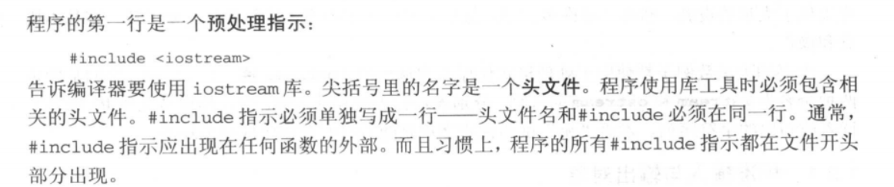


### 第二章 变量和基本类型

#### 2.1 基本内置类型


##### 2.1.1 算数类型

**整型**

**整型**：整数、字符、布尔型

带符号和无符号类型（signed、unsigned），**默认带符号**。unsigned后不加，意味着unsigned int

```
#取值越界                                                                                                                          无符号
例如：8位的unsigned char，取值范围是0~255，则数字对2^8 = 256取模，负数也是取模，如-1取模是255
有符号由编译器决定
```

**浮点型**

float一个字，6位有效数字

double两个字，至少10位有效数字

```
#建议
unsigned比较好，避免越界出现负数
很少用short
char尽量不要用来计算
用int比较好，不管是出错或者是性能
浮点就用double
```

##### 2.1.2 类型转换

自动类型转换

有符号会转换成无符号

`sizeof`可以看有多少个字节

##### 2.1.3 字面值常量

**1.整型字面值和浮点字面值**

20：10进制	024：8进制	0x14：十六进制

后面增加l或L，强制转化为long，用L；加U则unsigned；如1024UL


3.14159E0F

E是指数，F单精度，默认double

**3.布尔字面值、字符字面值和字符串字面值**

true和false

‘a' 单引号，L’a' wchar_t

“Hello World”


**4.非打印字符的转义序列**

```
\n	换行
\t
\r	回车
后面的是当你用到这些符号的时候
\\
\'
\?
\''
```

**5.字符串字面值**

"",会在字符串字面值加个空字符’\0‘

```
#字符串字面值连接
空格、制表符或者换行符分开最后都会连接
```


```
#用反斜线\就可以连接任何东西，不允许有任何东西
```


#### 2.2 变量

C++是一种静态类型语言，编译时会检查类型，所以需要先定义变量的类型

##### 2.2.1 什么是变量

**左值和右值：**左值可以出现在赋值语句的左边或者右边，右值只能出现在右边

**对象：**对象是内存中具有类型的区域

##### 2.2.2 变量名

变量的标识符，**字母、数字、下划线**，变量必须以字母或者下划线开头而且区分大小写

**1.C++关键字**


**2.变量命名习惯**

* 一般用小写字母
* 提示用法
* 每个词之间添加下划线：student_loan或者内嵌的词第一个字母都大写：studentLoan

##### 2.2.3 定义对象

类型说明符 变量名；

**1.初始化**

* 复制初始化 =
* 直接初始化()
* 列表初始化={} **列表初始化没有类型转换，所以里面必须是相应类型的**

**2.使用多个初始化式**

内置类型没区别

类类型有些初始化只能用直接初始化，**构造函数**，多个初始化式时不能用复制初始化

**3.初始化多个变量**

##### 2.2.4 变量初始化规则

**1.内置类型变量的初始化**

取决于变量定义的位置，函数体外为零，体里的不进行自动初始化（包括int）

**2.类类型变量的初始化**

构造函数控制初始化

没提供就会有**默认构造函数**

##### 2.2.5 声明和定义

**定义**：分配存储空间，指定初始值

**声明**：表明变量的类型和名字，定义也是声明。可以使用extern关键字声明


这时候是一个全局变量

##### 2.2.6 名字的作用域

用花括号界定

* 全局作用域：函数外部的名字
* 局部作用域：
* 语句作用域：比如for语句中

**作用域可嵌套**

##### 2.2.7 在变量使用处定义变量

通常把一个对象定义在首次使用的地方

#### 2.3 复合类型


##### 2.3.1 引用

引用就是别名，主要用作函数的形式参数，必须初始化


**1.引用是别名**

**2.定义多个引用**

**3.const 引用**


##### 2.3.2 指针


**定义**


**获取地址**

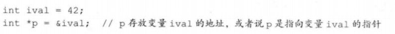

**利用指针访问对象**


**空指针**


**初始化所有指针，实在不清楚就`nullptr`**

**`void*`指针**


##### 2.3.4 理解复合类型的声明


**指向指针的指针**


**指向指针的引用**


#### 2.4 const限定符


#### 1.定义const对象

```
const int i = 0; //必须初始化
```

#### 2.const对象默认为文件的局部变量

想要别的用，要提前加extern

##### 2.4.1 const的引用

常量的引用必须是const的引用，但是const引用的对象不一定是个常量，所以这个常量有可能通过其他途径修改


##### 2.4.2 指针和const

**指向常量的指针**

和const的引用一样，但是指针可以改变指向的对象


**const 指针**

`*const` 必须初始化，指针不可以改变指向的对象，但是可以改变指向对象的值


##### 2.4.3 顶层const


##### 2.4.4 constexpr和常量表达式

#### 2.5 处理类型

##### 2.5.1 类型别名

 **typedef名字**

类型同义词


**using**


##### 2.5.2 auto类型说明符


auto会忽略顶层const，保留底层const


##### 2.5.3 decltype类型指示符


### 2.7 enum枚举


#### 2.8 类类型

#### 1.从操作开始设计类

接口和实现


#### 2.定义类


注意最后的分号

#### 3.类的数据成员

#### 4.访问标号

public和private

public可以在程序的任何部分访问

private只能被类的组成部分访问或者是该类的友元

#### 5.使用struct关键字

成员都是默认public，class默认为private

#### 2.9 编写自己的头文件

header file

#### 2.9.1设计自己的头文件


##### 1.头文件用于声明而不是用于定义


##### 2.一些const对象定义在头文件中

常量表达式初始化的const对象

#### 2.9.2 预处理器的简单介绍

#include是预处理器的一部分

##### 1. 头文件经常需要其他头文件

文件保护符

##### 2.避免多重包含

为了避免名字冲突，所以用全大写字母


##### 3.使用自定义的头文件


“” 认为是非系统头文件，查找通常开始于源文件所在的路径

### 第三章 字符串、向量和数组

#### 3.1 命名空间的using声明

作用域操作符 `::`

`using namespace::std`

`using std::cin`


**1.每个名字都需要一个using声明**

**2.使用标准库类型的类定义**

**3.头文件不应该包含using声明**

**习题**


```c++
#include <iostream>

using std::cin;
using std::cout;
using std::endl;

int main()
{
	int base, exponent;
    int result = 1;
    
    cout << "Enter base and exponent: " << endl;
    cin >> base >> exponent;
    
    if(exponent < 0){
        cout << "Exponent must be bigger than 0" << endl;
        return -1;
    } else {
        for(int cnt = 0; cnt < exponent; ++ cnt){
			result *= base;
        }
    }
    
    cout << "Result = " << result << endl;
    return 0;
}
```

#### 3.2 标准库string类型

长度可变的字符串

`#include <iostream>`

`using std::string`

##### 3.2.1 string对象的定义和初始化


##### 3.2.2 string对象的读写


**1.读入未知数目的string对象**

`while(cin >> word){}`

**2.用getline读取整行文本**

```c++
 string line;
 while(getline(cin, line)) #getline会丢弃输入时的换行符
        cout << s4 << endl;
```

##### 3.2.3 string对象的操作


**2.string::size_type类型**

s.size()返回的类型是string::size_type类型，而不是int，所以返回值不要赋给一个int对象。**C++11**中推荐用`auto`或者`decltype`

**3.string关系操作符**

比较大小是按照字典顺序的

**6.和字符串字面值连接**

左右操作数至少有一个需要是string


**7.获取字符**


**8.下标操作可用作左值**

##### 3.2.4 string对象中字符的处理


**习题**


```c++
#include <iostream>
#include <string>
#include <cctype>
using namespace std;

int main()
{
    string s1;
    string s2;

    cout << "Enter two string: ";
    cin >> s1 >> s2;

    if(s1 == s2)
        cout << "s1 == s2" << endl;
    else if(s1 > s2)
        cout << "s1 > s2" << endl;
    else
        cout << "s1 < s2" << endl;
    return 0;
}

int main()
{
    string s1;
    string s2;

    cout << "Enter two string: ";
    cin >> s1 >> s2;

    if(s1.size() == s2.size())
        cout << "s1 == s2" << endl;
    else if(s1.size() > s2.size())
        cout << "s1 > s2" << endl;
    else
        cout << "s1 < s2" << endl;
    return 0;
}
```


```c++
#include <iostream>
#include <string>
#include <cctype>
using namespace std;

int main()
{
    string s;
    string result;

    cin >> s;
    result = s;
    while(cin >> s){
        if(s != "EOF")
            result += ' ' + s;
        else
            break;
    }
    cout << result << endl;
    return 0;
}
```


```c++
#include <iostream>
#include <string>
#include <cctype>
using namespace std;

int main()
{
    string s;
    string result;

    cout << "Enter string with punct: ";
    cin >> s;

    for(string::size_type idx = 0; idx != s.size(); ++ idx){
        if(!ispunct(s[idx]))
            result += s[idx];
    }
    if(result.size() == s.size()){
        cout << "Enter wrong string" << endl;
        return -1;
    }
    else
        cout << result << endl;
    return 0;
}
```

#### 3.3 标准库vector类型

vector是同一种类型的对象的集合

```
#include <vector>
using std::vector;
```


##### 3.3.1 vector对象的定义和初始化


**1.创建确定个数的元素**


所以最好先创建空的，然后动态增加元素

**列表初始化**


**2.值初始化**


##### 3.3.2 vector对象的操作


**1.vector对象的size**

`vector<int>::size_type`

**2.向vector添加元素**


**下标操作不会添加元素，只能用push_back**

**习题**


```c++
#include <iostream>
#include <string>
#include <cctype>
#include <vector>
using namespace std;

int main()
{
    vector<int> ivec;
    int num;
    while(cin >> num)
        ivec.push_back(num);
    if(ivec.size() == 0){
        cout << "Error" << endl;
        return -1;
    }

    for(vector<int>::size_type idx = 0; idx < ivec.size() - 1; idx += 2)
        cout <<ivec[idx] + ivec[idx + 1] << endl;

    if(ivec.size() % 2 == 1)
        cout << ivec[ivec.size() - 1] << endl;
    return 0;
}

int main()
{
    vector<int> ivec;
    int num;
    while(cin >> num)
        ivec.push_back(num);
    if(ivec.size() == 0){
        cout << "Error" << endl;
        return -1;
    }

    for(vector<int>::size_type idx = 0; idx < ivec.size() / 2; idx += 1)
        cout <<ivec[idx] + ivec[ivec.size() - idx - 1] << endl;

    if(ivec.size() % 2 == 1)
        cout << ivec[ivec.size() / 2] << endl;
    return 0;
}
```


```c++
#include <iostream>
#include <string>
#include <cctype>
#include <vector>
using namespace std;

int main()
{
    vector<string> svec;
    string s1;

    while(cin >> s1)
        svec.push_back(s1);

    for(vector<string>::size_type idx = 0; idx != svec.size(); ++ idx){
        for(string::size_type idy = 0; idy != svec[idx].size(); ++ idy)
            svec[idx][idy] = toupper(svec[idx][idy]);
        cout << svec[idx] << '\t';
        if(idx % 8 == 7)
                cout << endl;
    }
    return 0;
}
```

#### 3.4 迭代器简介

另一种访问`vector`对象的元素的方法，`iterator`

**1.容器的iterator类型**

`vector<int>::iterator iter;`

**2.begin 和 end操作**


`vector<int>::iterator iter = ivec.begin();`


**3.vector迭代器的自增和解引用运算**


**5.程序示例**


c++11中修改为`auto`也可以，begin和end

**6.const_iterator**

只能读取，不能改变值，这个可以++iter

如果是const vector::iterator 就不可以++iter

**习题**


```c++
#include <iostream>
#include <string>
#include <cctype>
#include <vector>
using namespace std;

int main()
{
    vector<int> ivec;
    int n1;

    while(cin >> n1)
        ivec.push_back(n1);

    vector<int>::iterator iter;
    for(iter = ivec.begin(); iter < ivec.end() - 1; iter += 2)
        cout << *iter + *(iter + 1) << endl;

    if(ivec.size() % 2 == 1)
        cout << *iter << endl;
    return 0;
}

int main()
{
    vector<int> ivec;
    int n1;

    while(cin >> n1)
        ivec.push_back(n1);

    vector<int>::iterator first;
    vector<int>::iterator last;
    for(first = ivec.begin(), last = ivec.end() - 1; first < last; ++first, --last)
        cout << *first + *last << endl;

    if(first == last)
        cout << *first << endl;
    return 0;
}
```


```c++
#include <iostream>
#include <string>
#include <cctype>
#include <vector>
using namespace std;

int main()
{
    vector<string> svec;
    string s1;

    while(cin >> s1)
        svec.push_back(s1);

    int count = 0;
    for(vector<string>::iterator iter = svec.begin(); iter != svec.end(); iter ++){
        for(string::size_type idx = 0; idx != (*iter).size(); ++idx)
            (*iter)[idx] = toupper((*iter)[idx]);
        cout << *iter + ' ';
        if((count + 1) % 8 == 0)
            cout << endl;
        count ++;
    }
    return 0;
}
```


```c++
#include <iostream>
#include <string>
#include <cctype>
#include <vector>
using namespace std;

int main()
{
    vector<int> ivec(10, 10);

    for(vector<int>::iterator iter = ivec.begin(); iter != ivec.end(); ++iter){
        *iter *= 2;
        cout << *iter << endl;
    }
    return 0;
}c
```

**迭代器的算数操作**

* `iter + n`
* `iter1 - iter2`


#### 3.5 标准库bitset类型


```
#include <bitset>
using std::bitset
```

##### 3.5.1 bitset对象的定义和初始化


**1.unsigned值**


**2.string**


##### 3.5.2 bitset对象上的操作


#### 3.5 数组

如果不清楚元素的确切个数，使用vector。设计良好的程序只在强调速度时才在类实现的内部使用数组和指针。

##### 3.5.1 定义和初始化内置数组


**显式初始化数组元素**


**字符数组的特殊性**


**不允许拷贝和复制**


**理解复杂的数组声明**（由内向外，由右到左）


##### 3.5.2 访问数组元素


##### 3.5.3 指针和数组


**指针也是迭代器**


**begin和end**


**指针运算**

指向数组的指针运算和迭代器一样

pt[2]

*(pt + 2)


##### 3.5.4 C风格字符串

也就是cstring


最好不要用

##### 3.5.5 与旧代码接口

**混用string和C**

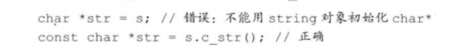

**使用数组初始化vector对象**


#### 3.6 多维数组


**初始化**


**多维数组的下标引用**

**使用for语句处理**


使用引用是为了避免数组呗自动转换成指针


**指针和多维数组**


**类型别名**


**练习**


```c++
#include <iostream>
#include <string>
#include <cctype>
#include <vector>
using namespace std;

int main()
{
    int arr[3][4] = {1, 2, 3, 4, 5};

    for(int (&row)[4] : arr){
        for(int &col : row)
            cout << col << " ";
        cout << endl;
    }
    cout << endl;

    for(size_t i = 0; i < 3; ++i){
        for(size_t j = 0; j < 4; ++j)
            cout << arr[i][j] << " ";
        cout << endl;
    }

    cout << endl;
    for(int (*p)[4] = begin(arr); p != end(arr); ++p){
        for(int *q = begin(*p); q != end(*p); ++q)
            cout << *q << " ";
        cout << endl;
    }
    return 0;
}
```

**类型别名**

```c++
#include <iostream>
#include <string>
#include <cctype>
#include <vector>
using namespace std;

using int_4 = int[4];
int main()
{
    int arr[3][4] = {1, 2, 3, 4, 5};

    for(int_4 &row : arr){
        for(int &col : row)
            cout << col << " ";
        cout << endl;
    }
    cout << endl;

    for(size_t i = 0; i < 3; ++i){
        for(size_t j = 0; j < 4; ++j)
            cout << arr[i][j] << " ";
        cout << endl;
    }

    cout << endl;
    for(int_4 *p = begin(arr); p != end(arr); ++p){
        for(int *q = begin(*p); q != end(*p); ++q)
            cout << *q << " ";
        cout << endl;
    }
    return 0;
}

```

### 第四章 表达式

表达式由一个或多个运算对象(operand)组成,对表达式求值将得到一个结果(result).·字面值和变量是最简单的表达式(expression),其结果就是字面值和变量的值。把一个运算符(operator)和一个或多个运算对象组合起来可以生成较复杂的表达式。

#### 4.1 基础

##### 4.1.1 基本概念

一元运算符 & *

二元运算符 + - * /

**重载运算符**

**左值和右值**

左值可以在左边，右值不可以

##### 4.1.2 优先级和结合律

page147

##### 4.1.3 求值顺序

没有规定，取决于编译器


#### 4.2 算术运算符

bool除了0都会被转化为true

余数直接丢弃，向0取整，**取余**结果可以先看除法的结果


#### 4.3 逻辑和关系运算符

&& 和 || 短路求值，算左再算右


#### 4.4 赋值运算符

可以用初始值列表赋值

满足右结合律


**复合赋值运算符**


#### 4.5 递增和递减运算符


除非必须，否则不用后置版本


#### 4.6 成员访问运算符

点运算符和箭头运算符

ptr->mem 等价于 （*ptr）.mem


合法：a d f

#### 4.7 条件运算符

?:

`cond?expr1:expr2`


**练习：**


```c++
int main()
{
    vector<int> ivec = {1, 2, 3, 4, 5};

    for(auto &val : ivec)
        val = (val % 2 == 1) ? val * 2 : val;

    for(auto val : ivec)
        cout << val << " ";

    return 0;
}
```


```c++
#include <iostream>
#include <string>
#include <cctype>
#include <vector>
using namespace std;

int main()
{
    string final_grade;
    int grade;

    while(cin >> grade && grade >= 0 && grade <= 100){
        final_grade = (grade > 90) ? "High pass"
                    : (grade > 75) ? "pass"
                    : (grade > 60) ? "Low pass" : "Fail";
        cout << final_grade << endl;
    }
    return 0;
}
```

#### 4.8 位运算符


#### 4.9 sizeof运算符


#### 4.10 逗号运算符


条件运算符优先级比逗号要高

#### 4.11 类型转换

**隐式转换**

##### 4.11.1 算术转换

转换成最宽的类型

首先会做整型提升，小整数类型转换成大整数类型，char变int

然后再做转换


##### 4.11.2 其他隐式类型转换

**数组转换成指针**

##### 4.11.3 显示转换

强制类型转换


`static_cast`

只要不包含底层const


`const_cast`

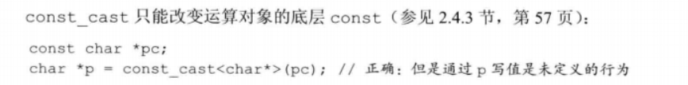

`reinterpret_cast`


**练习**


#### 4.12 运算符优先级表

### 第五章 语句

#### 5.1 简单语句

; 空语句

**复合语句**

#### 5.2 语句作用域

**练习**


#### 5.3 条件语句

`if`和`switch`

##### 5.3.1 if语句

```c++
if ()
	;
else if ()
	;
```


**练习**


```c++
#include <iostream>
#include <vector>
#include <string>

using namespace std;

int main() {
    int grade;
    cout << "请输入您的成绩：" << endl;
    cin >> grade;
    if (grade < 0 || grade > 100) {
        cout << "该成绩不合法" << endl;
        return -1;
    }
    if (grade == 100) {                             // 处理满分的情况
        cout << "等级成绩是：" << "A++" << endl;
        return 0;
    }
    const vector<string> scores = {"F", "D", "C", "B", "A"};
    string lettergrade;
    // 如果成绩不合格，不需要考虑添加加号减号的问题
    if (grade < 60)
        lettergrade = scores[0];
    else {
        lettergrade = scores[(grade - 50) / 10];    // 获得字母形式的成绩
        if (grade != 100)       // 只要不是 A++，就考虑添加加号减号
            if (grade % 10 > 7)
                lettergrade += '+';     // 末尾是 8 或者 9 的成绩添加一个加号
            else if (grade % 10 < 3)
                lettergrade += '-';     // 末尾是 0、1 或者 2 的成绩添加一个减号
    }
    cout << "等级成绩是：" << lettergrade << endl;

    return 0;
}
```

##### 5.3.2 switch语句


**练习**


```c++
#include <iostream>

using namespace std;

int main() {
    unsigned int vowelCnt = 0;
    char ch;
    cout << "请输入一段文本：" << endl;
    while (cin >> ch && ch != 'Q') {
        if (ch == 'a' || ch == 'e' || ch == 'i' || ch == 'o' || ch == 'u')
            ++vowelCnt;
    }
    cout << "您输入的文本中共有 " << vowelCnt << " 个元音字母" << endl;

    return 0;
}
```


```c++
#include <iostream>
#include <string>
#include <cctype>
#include <vector>
using namespace std;

int main()
{
    unsigned int ff_cnt = 0, fl_cnt = 0, fi_cnt = 0;
    char ch, prech = '\0';
    cout << "请输入一段文本：" << endl;
    while (cin >> noskipws >> ch)
    {
        switch (ch)
        {
        case 'f':
            if (prech == 'f')
                ++ ff_cnt;
            break;
        case 'l':
            if (prech == 'f')
                ++ fl_cnt;
            break;
        case 'i':
            if (prech == 'f')
                ++ fi_cnt;
            break;
        }
        prech = ch;
    }
    cout << "ff 的数量是：" << ff_cnt << endl;
    cout << "fl 的数量是：" << fl_cnt << endl;
    cout << "fi 的数量是：" << fi_cnt << endl;

    return 0;
}
```

**case 标签必须是整型常量表达式**

#### 5.4 迭代语句

循环 

循环前检查条件：`while`和`for`

先执行循环体：`do while`

##### 5.4.1 while语句

```c++
while (condition)
	statement
```

1）不清楚迭代几次的时候。2）循环结束后访问循环控制变量


**练习**

```c++
int main()
{
    string s;
    string pres = "/0";
    string max_s;
    unsigned max_cnt = 1;
    unsigned temp_cnt = 1;
    while(cin >> s)
    {
        if(s == pres)
        {
            ++ temp_cnt;
            if (temp_cnt >= max_cnt){
                max_cnt = temp_cnt;
                max_s = s;
            }

        }
        else
            temp_cnt = 1;
        pres = s;
    }

    if (max_cnt == 1)
        cout << "没有连续出现过" << endl;
    else
        cout << max_s << "出现过" << max_cnt << endl;

    return 0;
}

int main()
{
	pair<string, int> max_duplicated;
	int cnt;

	for(string str, prestr; cin >> str; prestr = str)
    {
        if (str == prestr)
            ++cnt;
        else
            cnt = 0;
        if (cnt > max_duplicated.second)
            max_duplicated = {str, cnt};
    }

    if (max_duplicated.second == 1)
        cout << "No duplication" << endl;
    else
        cout << max_duplicated.first << " occurs " << max_duplicated.second + 1 << " times " << endl;

	return 0;
}
```

##### 5.4.2 传统的for语句

```c++
for (init-statemen; condition; expression) // 先执行init-statement，判断condition
	statement
```

**for语句头中的多重定义**

`init-statement`只能有一条声明语句，因此，所有变量的基础类型必须相同

**省略for语句头的某些部分**

任何一个都可以被空语句替换

**练习**


```c++
#include <iostream>
#include <vector>

using std::cout; using std::vector;

bool is_prefix(const vector<int>& lhs, const vector<int>& rhs)
{
	if (lhs.size() > rhs.size())
		return is_prefix(rhs, lhs);
	for (unsigned i = 0; i != lhs.size(); ++i)
		if (lhs[i] != rhs[i]) 
			return false;
	return true;
}

int main()
{
	vector<int> l{ 0, 1, 1, 2 };
	vector<int> r{ 0, 1, 1, 2, 3, 5, 8 };
	cout << (is_prefix(r, l) ? "yes\n" : "no\n");

	return 0;
}
```

##### 5.4.3 范围for语句

```
for (declaration : expression)
	statement
```

##### 5.4.4 do while 语句

```
do
	statement
while (condition);
```


```c++
#include <iostream>
#include <string>

using std::cout; using std::cin; using std::endl; using std::string;

int main()
{
	string rsp;
	do
	{
		cout << "Input two strings: ";
		string str1, str2;
		cin >> str1 >> str2;
		cout << (str1 <= str2 ? str1 : str2)
			<< " is less than the other. " << "\n\n"
			<< "More? Enter yes or no: ";
		cin >> rsp;
	} while (tolower(rsp[0]) == 'y');
	return 0;
```

#### 5.5 跳转语句

`break`	`continue`	`goto`	 `return`

##### 5.5.1 break语句


**练习**


```c++
#include <iostream>
#include <string>
using std::cout; using std::cin; using std::endl; using std::string;

int main()
{
	string read, tmp;
	while (cin >> read)
		if (read == tmp) break; else tmp = read;

	if (cin.eof())  cout << "no word was repeated." << endl;
	else            cout << read << " occurs twice in succession." << endl;

	return 0;
}
```

##### 5.5.2 continue 语句


##### 5.5.3 goto语句


```
goto label;
label:
后面的都是
```

#### 5.6 try语句块和异常处理


##### 5.6.1 throw表达式

异常检测部分使用throw表达式引发一个异常


##### 5.6.2 try语句块

```c++
try {
	program-statements
} catch (exception-declaration) {
	handler-statements
}
```

```c++
while (true)
    {
        try
        {
            throw runtime_error("Data must refer to same ISBN");
        }
        catch (runtime_error err)
        {
            cout << err.what()
                << "\nTry Again? Enter y or n" << endl;
            char c;
            cin >> c;
            if (!cin || c == 'n')
                break;
        }
    }
    return 0;
```

##### 5.6.3 标准异常


**练习**


```c++
#include <iostream>
#include <stdexcept>
using std::cin; using std::cout; using std::endl; using std::runtime_error;

int main(void)
{
	int i, j;
	cout << "please input tow numbers: " << endl;
	while (cin >> i >> j)
	{
		try
		{
			if (j == 0)
				throw runtime_error("divisor is 0");
			cout << i / j << endl;
		}
		catch (runtime_error err)
		{
			cout << err.what() << "\nTry Again? Enter y or n" << endl;
			char c;
			cin >> c;
			if (c != 'y')
				break;
		}
		cout << "please input tow numbers: " << endl;
	}

	return 0;
}
```

### 第六章 函数

函数定义和声明，包括参数传入函数以及如何返回结果

允许重载函数，即不同函数可以使用同一个名字

函数指针

#### 6.1 函数基础

返回类型、名字、形参数列表、函数体

**编写函数**

```c++
int fact(int val)
{
	int result = 1;
	while (val > 1)
		result *= val--;
	
	return result;
}
```

**调用函数**


**形参和实参**

实参的类型和数量必须与形参匹配，类型会有强制类型转换

**函数的形参列表**

空：void f1(void)

必须把每个类型都写出来

任意两个形参不能同名，且函数最外层变量也不能同名

**函数返回类型**

不返回是void

返回类型不能是数组类型或函数类型，但是可以是指向数组或函数的指针

**练习**


```c++
int fact(int i)
{
	return i > 1 ? i * fact(i - 1) : 1;
}

void interactive_fact()
{
	std::string const prompt = "Enter a number within [1, 13) :\n";
	std::string const out_of_range = "Out of range, please try again.\n";
	for (int i; std::cout << prompt, std::cin >> i;)
	{
		if (i < 1 || i > 12)
		{
			std::cout << out_of_range;
			continue;
		}
		std::cout << fact(i) << std::endl;
	}
}

int main()
{
	interactive_fact();
	return 0;
}
```


```c++
#include <iostream>

int abs(int i)
{
    return i > 0 ? i : -i;
}

int main()
{
    std::cout << abs(-5) << std::endl;
    return 0;
}
```

##### 6.1.1 局部对象


**自动对象**

**局部静态对象**（定义的时候会被初始化，其他都不会）


##### 6.1.2 函数声明

只可以定义一次，声明多次。 如果一个函数永远不会被用到，可以只有声明，没有定义。

声明无需函数体，用一个分号代替

可以无需形参的名字，但是也最好写

**在头文件中进行函数声明**

##### 6.1.3 分离式编译


**编译和链接多个源文件**

如果修改了一个源文件，只需要重新编译改动了的文件


#### 6.2 参数传递


引用的话才可以更改原来的值**引用调用**，不然的话只是拷贝**值传递**

##### 6.2.1 传值参数

形参操作不影响实参

**指针形参**


**练习**


```c++
#include <iostream>
#include <string>

void swap(int* lhs, int* rhs)
{
	int tmp;
	tmp = *lhs;
	*lhs = *rhs;
	*rhs = tmp;
}

int main()
{
	for (int lft, rht; std::cout << "Please Enter:\n", std::cin >> lft >> rht;)
	{
		swap(&lft, &rht);
		std::cout << lft << " " << rht << std::endl;
	}

	return 0;
}
```

##### 6.2.2 传引用参数

相当于别名

**使用引用避免拷贝**

​	拷贝比较低效，且有的不支持拷贝操作


**使用引用形参返回额外信息**

可以帮助返回多个值


**练习**


```c++
#include <iostream>
#include <string>

void swap(int &lhs, int &rhs)
{
	int tmp;
	tmp = lhs;
	lhs = rhs;
	rhs = tmp;
}

int main()
{
	for (int lft, rht; std::cout << "Please Enter:\n", std::cin >> lft >> rht;)
	{
		swap(lft, rht);
		std::cout << lft << " " << rht << std::endl;
	}

	return 0;
}
```

##### 6.2.3 const 形参和实参


**指针或 引用形参与const**

**尽量使用常量引用**

**练习**


```c++
#include <iostream>
#include <string>
#include <cctype>
using namespace::std;
bool is_upper(const string &s)
{
    for (auto c : s)
        if (isupper(c))
            return false;
        else
            return true;
}

string to_lowercase(string &s)
{
    for (auto &c : s)
        if (isupper(c))
            c = tolower(c);
    return s;
}

int main()
{
	string str = "adFasdf";

	cout << is_upper(str) << endl;
    cout << to_lowercase(str) << endl;

	return 0;
}
```

##### 6.2.4 数组形参

数组不允许拷贝数组；使用数组时会将其转换成指针

所以实际上传递的是首元素的指针


函数不知道数组的确切尺寸，所以

**使用标记指定数组长度**

要求数组本身包含一个结束标记，C风格字符串


**使用标准库规范**

传递首元素和尾后元素


**显示传递一个表示数组大小的形参**


**数组形参和const**


**数组引用形参**


这个会有大小限制

**传递多维数组**


**练习**


```c++
#include <iostream>
#include <string>
#include <cctype>
using namespace::std;

void swap(int *&lft, int *&rft)
{
    auto tmp = lft;
    lft =rft;
    rft = tmp;
}

int main()
{
	int i = 42, j = 99;
	auto lft = &i;
	auto rht = &j;
	swap(lft, rht);
	cout << *lft << " " << *rht << endl;
	return 0;
}
```

##### 6.2.5 main: 处理命令行选项

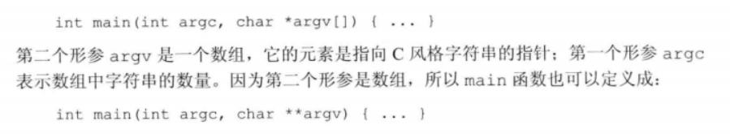


```c++
#include <iostream>
#include <string>

int main(int argc, char **argv)
{
	std::string str;
	for (int i = 1; i != argc; ++i)
		str += std::string(argv[i]) + " ";

	std::cout << str << std::endl;
	return 0;
}
```

##### 6.2.6 含有可变形参的函数

两种方法： 

* 所有实参类型相同： `initializer_list`
* 特殊函数，可变参数模板

**initializer_list**


**省略符形参**


**练习**


```c++
  
#include <iostream>
#include <initializer_list>

int sum(std::initializer_list<int> const& il)
{
	int sum = 0;
	for (auto i : il) 
		sum += i;
	return sum;
}

int main(void)
{
	auto il = { 1, 2, 3, 4, 5, 6, 7, 8, 9 };
	std::cout << sum(il) << std::endl;

	return 0;
}
```

#### 6.3 返回类型和return语句

##### 6.3.1 无返回值函数

* 无返回值
* void函数

`return;`

##### 6.3.2 有返回值函数

保证类型是正确的


**值如何被返回**


**不要返回局部对象的引用和指针**


**返回类类型的函数和调用运算符**

类类型可以访问结果对象的成员

**引用返回左值**

引用是左值，其他返回类型是右值

所以函数引用返回可以在赋值语句的左侧


**列表初始化返回值**


**主函数main的返回值**


**递归**

函数调用了自身

递归循环

**练习**

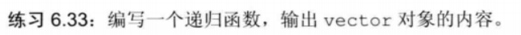

```c++
#include <iostream>
#include <string>
#include <cstdlib>
#include <vector>
using namespace::std;

void print(vector<int> ivec, auto index)
{
    if(index != ivec.size())
    {
        cout << ivec[index] << endl;
        print(ivec, index + 1);
    }
    return;
}

int main()
{
    vector<int> ivec = {1, 2, 32, 43};
    print(ivec, 0);

    return 0;
}
```

##### 6.3.3 返回数组指针

因为数组不能被拷贝，所以不能返回数组，只能返回数组的指针或引用

使用类型别名


**声明一个返回数组指针的函数**


**使用尾置返回类型**


**使用decltype**


**练习**


```c++
string (&func())[10];

typedef string arr[10];
arr &func();

auto func() -> string (&)[10];

string str[10];
decltype(str) &func();
```

#### 6.4 函数重载

同一作用域，名字相同但形参列表不同：**重载函数**

main函数不能重载

**定义重载函数**


**判断两个形参的类型是否相异**

省略名字和别名还是相同

**重载和const形参**

顶层const


底层const


优先使用非常量版本的函数

**const_cast和重载**


**调用重载的函数**

* 最佳匹配
* 无匹配的错误信息
* 二义性调用：有多个函数可以匹配

##### 6.4.1 重载于作用域


#### 6.5 特殊用途语言特性

* 默认实参
* 内联函数
* constexpr函数

#### 6.5.1 默认实参

一旦某个形参被赋予了默认值，后面的所有形参都必须有默认值

**使用默认实参调用函数**

直接省略就好

**默认实参声明**

只能赋予一次实参


**默认实参初始化**

局部变量不能作为默认实参，其他只要可以转换的就可以

##### 6.5.2 内联函数和const而向旁人函数

**内联函数可避免函数调用的开销**

在编译时直接替换

只要在返回类型前面加上inline就好了


**constexpr 函数**

constexpr 函数是指能用于常量表达式的函数，constexpr 函数的返回类型和所有形参的类型都得是字面值类型，而且函数体中必须有且只有一条 return 语句。

**把内联函数和constexpr函数放在头文件内**

#### 6.5.3 调试帮助

用于调试的代码

预处理功能：assert和NDEBUG

**assert预处理宏**

类似内联函数


**NDEBUG预处理变量**


**练习**


```c++
#include <iostream>
#include <vector>

using namespace std;

// 递归函数输出 vector<int> 的内容
void print(vector<int> vInt, unsigned index) {
    unsigned sz = vInt.size();
    // 设置在此处输出调试信息
    #ifndef NDEBUG
    cout << "vector 对象的大小是：" << sz << endl;
    #endif // NDEBUG
    if (!vInt.empty() && index < sz) {
        cout << vInt[index] << endl;
        print(vInt,index + 1);
    }
}

int main() {
    vector<int> v = {1, 3, 5, 7, 9, 11, 13, 15};
    print(v, 0);
    return 0;
}
```

#### 6.6 函数匹配

形参数量相等且可以类型转换时

**确定候选函数和可行函数**

候选函数就是名字

科兴函数就是实参数量以及类型

**寻找最佳匹配**

类型越匹配

**含有多个形参的函数匹配**


#### 6.6.1 实参类型转换

1.精确匹配

2.const

3.类型提升

4.算数类型转换

5.类类型转换

**需要类型提升和算术类型转换 的匹配**

**函数匹配和const实参**

#### 6.7 函数指针


**使用函数指证**


不需要取地址符，也不需要解引用

**重载函数的指针**


**函数指针形参**


**返回指向函数的指针**


也可以尾置

**将auto和decltype用于函数指针类型**


### 第七章 类

类的基本思想是**数据抽象**和**封装**。

数据抽象依赖于接口和实现，封装实现了类的接口和实现的分离

#### 7.1 定义抽象数据类型

令Sales_data变成抽象数据类型

##### 7.1.1 设计Sales_data类


**练习**


Sale_data.h

```c++
#ifndef TEST_SALES_DATA_H
#define TEST_SALES_DATA_H

// Definition of Sales_data class and related functions goes here
#include <iostream>
#include <string>

// 头文件不应包含 using 声明
// using namespace std;

class Sales_data {
    // 友元函数
    friend std::istream &operator>>(std::istream &, Sales_data &);

    // 友元函数
    friend std::ostream &operator<<(std::ostream &, const Sales_data &);

    // 友元函数
    friend bool operator<(const Sales_data &, const Sales_data &);

    // 友元函数
    friend bool operator==(const Sales_data &, const Sales_data &);

public:     // 构造函数的 3 种形式
    Sales_data() = default;

    Sales_data(const std::string &book) : bookNo(book) {}

    Sales_data(std::istream &is) { is >> *this; }

    Sales_data &operator+=(const Sales_data &);

    std::string isbn() const { return bookNo; }

private:
    std::string bookNo;         // 书籍编号，隐式初始化为空串
    unsigned units_sold = 0;    // 销售量，显式初始化为 0
    double sellingprice = 0.0;  // 原始价格，显式初始化为 0.0
    double saleprice = 0.0;     // 实售价格，显式初始化为 0.0
    double discount = 0.0;      // 折扣，显式初始化为 0.0
};

inline bool compareIsbn(const Sales_data &lhs, const Sales_data &rhs) {
    return lhs.isbn() == rhs.isbn();
}

Sales_data operator+(const Sales_data &, const Sales_data &);

inline bool operator==(const Sales_data &lhs, const Sales_data &rhs) {
    return lhs.units_sold == rhs.units_sold &&
           lhs.sellingprice == rhs.sellingprice &&
           lhs.saleprice == rhs.saleprice &&
           lhs.isbn() == rhs.isbn();
}

inline bool operator!=(const Sales_data &lhs, const Sales_data &rhs) {
    return !(lhs == rhs);   // 基于运算符 == 给出 != 的定义
}

Sales_data &Sales_data::operator+=(const Sales_data &rhs) {
    units_sold += rhs.units_sold;
    saleprice = (rhs.saleprice * rhs.units_sold + saleprice * units_sold)
                / (rhs.units_sold + units_sold);
    if (sellingprice != 0)
        discount = saleprice / sellingprice;
    return *this;
}

Sales_data operator+(const Sales_data &lhs, const Sales_data &rhs) {
    Sales_data ret(lhs);    // 把 lhs 的内容拷贝到临时变量 ret 中，这种做法便于运算
    ret += rhs;             // 把 rhs 的内容加入其中
    return ret;             // 返回 ret
}

std::istream &operator>>(std::istream &in, Sales_data &s) {
    in >> s.bookNo >> s.units_sold >> s.sellingprice >> s.saleprice;
    if (in && s.sellingprice != 0)
        s.discount = s.saleprice / s.sellingprice;
    else
        s = Sales_data();   // 输入错误，重置输入的数据
    return in;
}

std::ostream &operator<<(std::ostream &out, const Sales_data &s) {
    out << s.isbn() << " " << s.units_sold << " "
        << s.sellingprice << " " << s.saleprice << " " << s.discount;
    return out;
}

#endif //TEST_SALES_DATA_H
```

main.cpp

```c++
#include <iostream>
#include "Sales_data.h"
using namespace std;

int main() {
    cout << "请输入交易记录（ISBN、销售量、原价、实际售价）：" << endl;
    Sales_data total;               // 保存当前求和结果的变量
    if (cin >> total) {             // 读入第一笔交易记录
         Sales_data trans;          // 保存下一条交易数据的变量
         while (cin >> trans) {     // 读入剩余的交易
             if (total.isbn() == trans.isbn())  // 检查 isbn
                 total += trans;    // 更新变量 total 当前的值
             else {
                 cout << total << endl;     // 输出结果
                 total = trans;             // 处理下一本
             }
         }
         cout << total << endl;     // 输出最后一条交易
    }
    else {                              // 没有输入任何信息
        cerr << "No data?!" << endl;    // 通知用户
        return -1;
    }
    return 0;
}
```


##### 7.1.2 定义改进的Sales_data类


**定义成员函数** 


**引入this**


**引入const成员函数**


这里面为什么需要用到参数列表后面的const呢？因为在实际调用的时候

```c++
inline bool compare_isbn(const Sales_data &lhs, const Sales_data &rhs)
{
    return lhs.isbn() == rhs.isbn();
}
```

所以需要修改this指针的类型

**类作用域和成员函数**


**在类的外部定义成员函数**

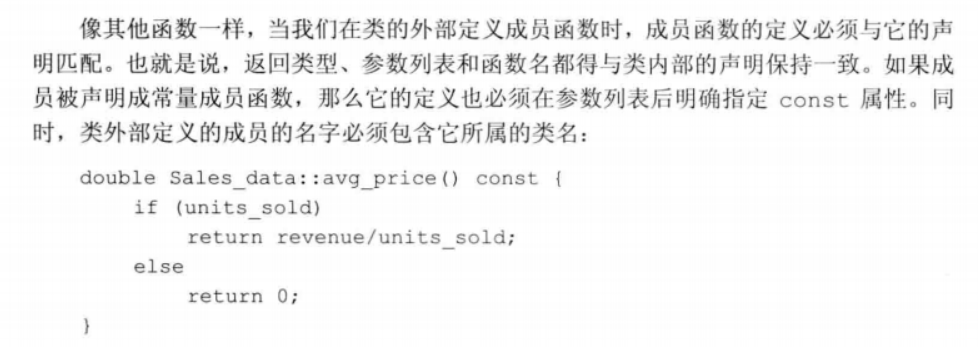

**定义一个返回this对象的函数**


引用对应 `*this`，就可以返回本身对象

**练习**


```c++
std::string isbn() const { return bookNo;}

Sales_data & combine(const Sales_data &rhs)
{
    sale_price = (rhs.sale_price * rhs.units_sold + sale_price * units_sold) / (rhs.units_sold + units_sold);
    units_sold += rhs.units_sold;
    if (selling_price != 0)
        discount = sale_price / selling_price;
    return *this;
}
```


```
total.combine(trans);
```


Person.h

```c++
#ifndef PERSON_H_INCLUDED
#define PERSON_H_INCLUDED

#include <iostream>
#include <string>

class Person
{
    friend std::istream &operator>>(std::istream &, Person &);

    friend std::ostream &operator<<(std::ostream &, Person &);
public:
    std::string get_name() const { return person_name; }
    std::string get_address() const { return address; }
private:
    std::string person_name;
    std::string address;
};

std::istream &operator>>(std::istream &is, Person &pes)
{
    is >> pes.person_name >> pes.address;
    return is;
}

std::ostream &operator<<(std::ostream &os, Person &pes)
{
    os << pes.person_name << '\t' << pes.address;
    return os;
}
#endif // PERSON_H_INCLUDED
```

##### 7.1.3 定义类相关的非成员函数

跟类声明在同一个头文件内

**定义read和print函数**


**定义add函数**


**练习**


Sale_data.h

```c++
#ifndef TEST_SALES_DATA_H
#define TEST_SALES_DATA_H

// Definition of Sales_data class and related functions goes here
#include <iostream>
#include <string>

// 头文件不应包含 using 声明
// using namespace std;

class Sales_data {
private:                            // 定义私有数据成员
    std::string bookNo;             // 书籍编号，隐士初始化为空串
    unsigned units_sold = 0;        // 销售量，显示初始化为 0
    double sellingprice = 0.0;      // 原始售价，显示初始化为 0.0
    double saleprice = 0.0;         // 实售价格，显示初始化为 0.0
    double discount = 0.0;          // 折扣，显示初始化为 0.0
public:                             // 定义公有函数成员
    // isbn 函数只有一条语句，返回 bookNo
    std::string isbn() const { return bookNo; }
    // combine 函数用于把两个 ISBN 相同的销售记录合并在一起
    Sales_data& combine(const Sales_data &rhs) {
        units_sold += rhs.units_sold;   // 把 rhs 的成员加到 this 对象的成员上
        saleprice = (rhs.saleprice * rhs.units_sold + saleprice * units_sold)
                    / (rhs.units_sold + units_sold);    // 计算平均实际售价
        if (sellingprice != 0)
            discount = saleprice / sellingprice;    // 计算 this 对象的折扣
        return *this;               // 返回调用该函数的对象
    }
    Sales_data add(const Sales_data &lhs, const Sales_data &rhs);
    std::istream &read(std::istream &is, Sales_data &item);
    std::ostream &print(std::ostream &os, const Sales_data &item);
};

Sales_data Sales_data::add(const Sales_data &lhs, const Sales_data &rhs) {
    Sales_data sum = lhs;
    sum.combine(rhs);
    return sum;
}

std::istream &Sales_data::read(std::istream &is, Sales_data &item) {
    is >> item.bookNo >> item.units_sold >> item.sellingprice >> item.saleprice;
    if (is && item.sellingprice != 0)
        item.discount = item.saleprice / item.sellingprice;
    else
        item = Sales_data();   // 输入错误，重置输入的数据
    return is;
}

std::ostream &Sales_data::print(std::ostream &os, const Sales_data &item) {
    os << item.isbn() << " " << item.units_sold << " " << item.sellingprice
       << " " << item.saleprice << " " << item.discount;
    return os;
}

#endif //TEST_SALES_DATA_H
```

main.cpp

```c++
#include "Sales_data.h"
using namespace std;

int main() {
    cout << "请输入交易记录（ISBN、销售量、原价、实际售价）：" << endl;
    Sales_data total;               // 保存当前求和结果的变量
    if (total.read(cin, total)) {             // 读入第一笔交易记录
        Sales_data trans;          // 保存下一条交易数据的变量
        while (trans.read(cin, trans)) {     // 读入剩余的交易
            if (total.isbn() == trans.isbn())  // 检查 isbn
                total = total.add(total, trans);     // 更新变量 total 当前的值
            else {
                total.print(cout, total) << endl;    // 输出结果
                total = trans;                 // 处理下一本
            }
        }
        total.print(cout, total) << endl;            // 输出最后一条交易
    }
    else {                              // 没有输入任何信息
        cerr << "No data?!" << endl;    // 通知用户
        return -1;
    }
    return 0;
}
```


```c++
std::istream &Person::read(std::istream &is, Person &pes)
{
    is >> pes.person_name >> pes.address;
    return is;
}

std::ostream &Person::print(std::ostream &os, const Person &pes)
{
    os << pes.person_name << '\t' << pes.address;
    return os;
}
```

##### 7.1.4 构造函数

初始化类对象的数据成员

**合成的默认构造函数**

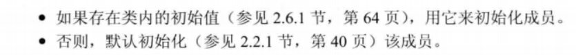

**某些类不能依赖于合成的默认构造函数**


所以需要定义默认构造函数

**定义Sales_data的构造函数**

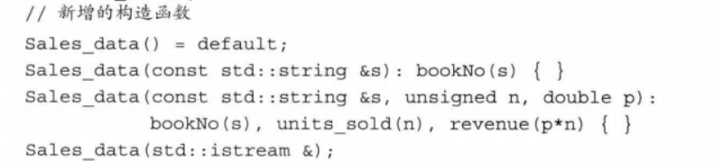

**= default的含义**

要求编译器生成构造函数

**构造函数初始值列表**


**在类的外部定义构造函数**


**练习**


```c++
Person() = default;
Person(const std::string &nam, const std::string &add) : person_name(nam), address(add) {}
Person(std::istream &);

Person::Person(std::istream &is)
{
    read(is, *this);
}
```

##### 7.1.5 拷贝、赋值和析构

**某些类不能依赖于合成的版本**


#### 7.2 访问控制与封装

访问说明符加强类的封装


**使用class或struct关键字**

struct默认public，class默认private

##### 7.2.1 友元


#### 7.3 类的其他特性

##### 7.3.1 类成员再探

Screen和Window-mgr

**定义一个类型成员**

1.自定义某种类型在类中的别名


要先定义后使用

**Screen类的成员函数**


**令成员作为内联函数**

最好只在类外部定义的地方说明inline


**重载成员函数**

一样的

**可变数据成员**

`mutable` 即使在const成员函数中也可以被修改

**类数据成员的初始值**


**练习**


```c++
class Screen {
private:
    unsigned height = 0, width = 0;
    unsigned cursor = 0;
    string contents;

public:
    Screen() = default;     // 默认构造函数
    Screen(unsigned ht, unsigned wd) : height(ht), width(wd),
        contents(ht * wd, ' ') { }
    Screen(unsigned ht, unsigned wd, char c)
        : height(ht), width(wd), contents(ht * wd, c) { }
};
```


含有指针数据成员的类一般不宜使用默认的拷贝和赋值操作，如果类的数据成员都是内置类型的，则不受干扰。

##### 7.3.2 返回*this的成员函数

**从const成员函数返回*this**


**基于const的重载**


**练习**


Screen.h

```c++
#ifndef SCREEN_H_INCLUDED
#define SCREEN_H_INCLUDED

#include <iostream>

class Screen {
private:
    unsigned height = 0, width = 0;
    unsigned cursor = 0;
    std::string contents;

public:
    Screen() = default;     // 默认构造函数
    Screen(unsigned ht, unsigned wd) : height(ht), width(wd),
                                       contents(ht * wd, ' ') {}

    Screen(unsigned ht, unsigned wd, char c)
            : height(ht), width(wd), contents(ht * wd, c) {}

public:
    Screen &move(unsigned r, unsigned c) {
        cursor = r * width + c;
        return *this;
    }
    Screen &set(char ch) {
        contents[cursor] = ch;
        return *this;
    }
    Screen &set(unsigned r, unsigned c, char ch) {
        contents[r * width + c] = ch;
        return *this;
    }
    Screen &display(std::ostream &os) {
        os << contents;
        return *this;
    }
};

#endif // SCREEN_H_INCLUDED

```

main.cpp

```c++
#include <iostream>
#include "Screen.h"

int main() {
    Screen myScreen(5, 5, 'X');
    myScreen.display(std::cout);
    std::cout << "\n";
    myScreen.move(4, 0).set('#').display(std::cout);
    std::cout << "\n";
    myScreen.display(std::cout);
    std::cout << "\n";

    return 0;
}
```

##### 7.3.3 类类型


**类的声明**

声明和定义可以分开

前向声明，不完全类型

##### 7.3.4 友元再探


**类之间的友元关系**


友元关系不存在传递性


**令成员函数作为友元**


**函数重载和友元**

要对每个重载函数分别声明

**友元声明和作用域**


**练习**


```c++
#include <iostream>
#include <string>
using namespace std;

class Window_mgr {
public:
    void clear();
};

class Screen {
    friend void Window_mgr::clear();

private:
    unsigned height = 0, width = 0;
    unsigned cursor = 0;
    std::string contents;
public:
    Screen() = default;     // 默认构造函数
    Screen(unsigned ht, unsigned wd, char c)
            : height(ht), width(wd), contents(ht * wd, c) {}
};

void Window_mgr::clear() {
    Screen myScreen(10, 20, 'X');
    cout << "清理之前 myScreen 的内容是：" << endl;
    cout << myScreen.contents << endl;
    myScreen.contents = "";
    cout << "清理之后 myScreen 的内容是：" << endl;
    cout << myScreen.contents << endl;
}

int main() {
    Window_mgr w;
    w.clear();
    return 0;
}
```

#### 7.4 类的作用域

**作用域和定义在类外部的成员**

一个类就是一个作用域

第一种


第二种


##### 7.4.1 名字查找与类的作用域


**用于类成员声明的名字查找**

**类型名要特殊处理**


**成员定义中的普通块作用域的名字查找**


**类作用域之后，在外围的作用域中查找**


#### 7.5 构造函数再探

##### 7.5.1 构造函数初始值列表


**成员初始化的顺序**

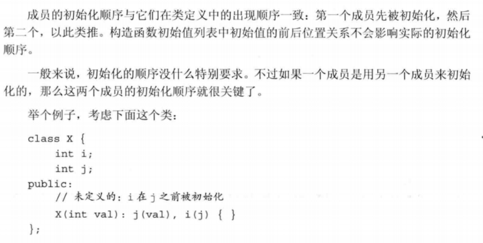


**默认实参和构造函数**

相当于在参数表里面设定一个值


##### 7.5.2 委托构造函数


就只写一个构造函数，别的构造函数都利用这个构造函数生成

##### 7.5.3 默认构造函数的作用


**使用默认构造函数**


**练习**

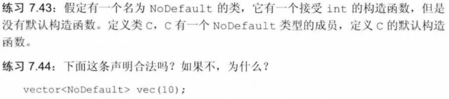

上述语句的含义是创建一个 vector 对象 vec，该对象包含 10 个元素，每个元素的类型都是 NoDefault 且执行默认初始化。然而，因为我们在类 NoDefault 的定义中没有设计默认构造函数，所以所需的默认初始化过程无法执行。编译器会报告这一错误。

##### 7.5.4 隐式的类类型转换

转换构造函数


**只允许一步类类型转换**


**抑制构造函数定义的隐式转换**

加`explicit`


explicit只能用于直接初始化


**为转换显示地使用构造函数**


##### 7.5.5 聚合类


##### 7.5.6 字面值常量类

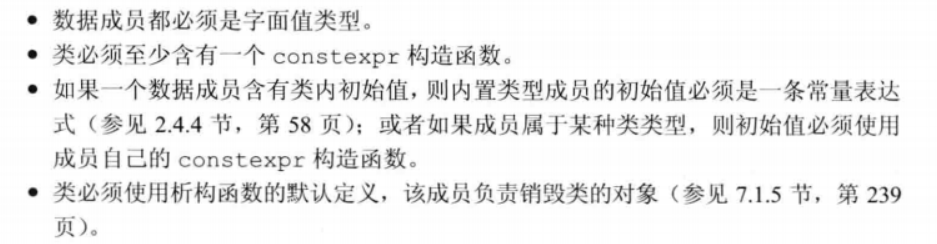

**constexpr构造函数**


#### 7.6 类的静态成员

**声明静态成员**

`static`


**使用类的静态成员**


**定义静态成员**


**静态成员能用于某些场景**


## 第II部分 C++标准库

### 第八章 IO库

#### 8.1 IO类


**IO类型间的关系**


##### 8.1.1 IO对象无拷贝或赋值

所以需要设置成引用

##### 8.1.2 条件状态

确定一个流对象 的状态最简单对的方法是将它当作一个条件来使用


**查询流的状态**

**管理条件状态**


**练习**


```c++
#include <iostream>
using namespace std;

istream& func(istream &is)
{
    std::string buf;
    while (is >> buf)
        std::cout << buf << std::endl;
    is.clear();
    return is;
}

int main() {
    cout << "请输入一些整数，按 Ctrl+Z 结束" << endl;
    func(cin);

    return 0;
}
```

##### 8.1.3 管理输出缓存

文本串可能立即打印出来，也可能保存在缓冲区

缓冲刷新（数据真正写到输出设备或文件）：

* endl显式刷新

**刷新输出缓冲区**


**unitbuf操纵符**


**关联输入和输出流**

cin会导致cout的缓冲区刷新

#### 8.2 文件输入输出

头文件`fstream`

`ifstream`:读数据

`ofstream`:写数据


##### 8.2.1 使用文件流对象


**用fstream代替iostream&**


**成员函数open和close**


**自动构造和析构**

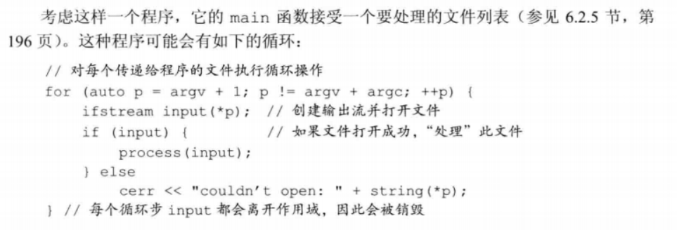

 **练习**


```c++
#include <iostream>
#include <fstream>
#include <string>
#include <vector>

using namespace std;

int main() {
    // ../data 为文件data的文件名及其相对路径（是相对于可执行程序所在目录的相对路径）
    ifstream in("data.txt");         // 打开文件
    if (!in) {
        cerr << "无法打开输入文件" << endl;
        return -1;
    }

    string line;
    vector<string> words;
    while (getline(in, line))       // 从文件中读取一行
        words.push_back(line);      // 添加到 vector 中

    in.close();                     // 输入完毕，关闭文件

    vector<string>::const_iterator it = words.begin();  // 迭代器
    while (it != words.end()) {     // 遍历 vector
        cout << *it << endl;        // 输出 vector 中的元素
        ++it;
    }

    return 0;
}
```


```c++
#include <iostream>
#include <fstream>
#include "Sales_data.h"
using namespace std;

int main(int argc, char *argv[]) {
    if (argc != 2) {
        cerr << "请给出文件名" << endl;
        return -1;
    }
    ifstream in(argv[1]);
    if (!in) {
        cerr << "无法打开输入文件" << endl;
        return -1;
    }

    Sales_data total;               // 保存当前求和结果的变量
    if (total.read(in, total)) {             // 读入第一笔交易记录
        Sales_data trans;          // 保存下一条交易数据的变量
        while (trans.read(in, trans)) {     // 读入剩余的交易
            if (total.isbn() == trans.isbn())  // 检查 isbn
                total = total.add(total, trans);     // 更新变量 total 当前的值
            else {
                total.print(cout, total) << endl;    // 输出结果
                total = trans;                 // 处理下一本
            }
        }
        total.print(cout, total) << endl;            // 输出最后一条交易
    }
    else {                              // 没有输入任何信息
        cerr << "没有数据" << endl;    // 通知用户
        return -1;
    }
    return 0;
}
```

**8.2.2 文件模式**


**每次调用open时都会确认文件模式**


**练习**


```c++
#include <iostream>
#include <fstream>
#include "Sales_data.h"
using namespace std;

int main(int argc, char *argv[]) {
    if (argc != 3) {
        cerr << "请给出文件名" << endl;
        return -1;
    }
    ifstream in(argv[1]);
    if (!in) {
        cerr << "无法打开输入文件" << endl;
        return -1;
    }
    ofstream out(argv[2]);
    if (!out) {
        cerr << "无法打开输出文件" << endl;
        return -1;
    }

    Sales_data total;               // 保存当前求和结果的变量
    if (total.read(in, total)) {             // 读入第一笔交易记录
        Sales_data trans;          // 保存下一条交易数据的变量
        while (trans.read(in, trans)) {     // 读入剩余的交易
            if (total.isbn() == trans.isbn())  // 检查 isbn
                total = total.add(total, trans);     // 更新变量 total 当前的值
            else {
                total.print(out, total) << endl;    // 输出结果
                total = trans;                 // 处理下一本
            }
        }
        total.print(out, total) << endl;            // 输出最后一条交易
    }
    else {                              // 没有输入任何信息
        cerr << "没有数据" << endl;    // 通知用户
        return -1;
    }
    return 0;
}
```

#### 8.3 string流

头文件`sstream`

`istringstream`读数据

`ostringstream`写数据

##### 8.3.1 使用istringstream


```c++
#include <iostream>
#include <sstream>
#include <string>
#include <stdexcept>

using namespace std;

istream &f(istream &in) {
    string v;
    while (in >> v, !in.eof()) {
        if (in.bad())
            throw runtime_error("IO 流错误");
        if (in.fail()) {
            cerr << "数据错误，请重试" << endl;
            in.clear();
            in.ignore(100, '\0');
            continue;
        }
        cout << v << endl;
    }
    in.clear();
    return in;
}

int main() {
    ostringstream msg;
    msg << "C++ Primer 第五版" << endl;
    istringstream in(msg.str());
    f(in);
    return 0;
}
Copy
// 运行结果
C++
Primer
第五版

Process finished with exit code 0
```

##### 8.3.2 使用ostringstream


```c++
#include <iostream>
#include <fstream>
#include <sstream>
#include <string>
#include <vector>

using namespace std;

struct PersonInfo {
    string name;
    vector<string> phones;
};

string format(const string &s) {
    return s;
}

bool valid(const string &s) {
    // 如何验证电话号码将在第 17 章介绍
    // 现在简单返回 true
    return true;
}

int main(int argc, char *argv[]) {
    string line, word;              // 分别保存来自输入的一行和单词
    vector<PersonInfo> people;      // 保存来自输入的所有记录
    istringstream record;

    if (argc != 2) {
        cerr << "请给出文件名" << endl;
        return -1;
    }
    ifstream in(argv[1]);
    if (!in) {
        cerr << "无法打开输入文件" << endl;
        return -1;
    }

    // 逐行从输入读取数据，直至 cin 遇到文件尾（或其他错误）
    while (getline(in, line)) {
        PersonInfo info;            // 创建一个保存此记录数据的对象
        record.clear();             // 重复使用字符串流时，每次都要调用 clear
        record.str(line);           // 将记录绑定到刚读入的行（将 line 拷贝到 record 中）
        record >> info.name;        // 读取名字
        while (record >> word)      // 读取电话号码
            info.phones.push_back(word);    // 保持它们
        people.push_back(info);     // 将此记录追加到 people 末尾
    }

    ostringstream os;
    for (const auto &entry : people) {  // 对 people 中每一项
        ostringstream formatted, badNums;   // 每个循环步创建的对象
        for (const auto &nums : entry.phones) {     // 对每个数
            if (!valid(nums))
                badNums << " " << nums;     // 将数的字符串形式存入 badNums
            else
                // 将格式化的字符串"写入" formatted
                formatted << " " << format(nums);
        }
        if (badNums.str().empty())      // 没有错误的数
            // 打印名字和格式化的数
            os << entry.name << " " << formatted.str() << endl;
        else
            // 否则，打印名字和错误的数
            cerr << "input error: " << entry.name
            << " invalid numbers(s) " << badNums.str() << endl;
    }
    cout << os.str() << endl;

    return 0;
}
Copy
// 运行结果
zhangsan  23443 34432
lisi  23423434
wangwu  234324


Process finished with exit code 0
```

### 第九章 顺序容器

#### 9.1 顺序容器概述


#### 9.2 容器库概览

通用操作

**对容器可以保存的元素类型的限制**


##### 9.2.1 迭代器

使用解引用运算符来访问

**迭代器范围**

[begin, end)


```c++
#include <iostream>
#include <vector>
using namespace std;

vector<int>::iterator search_vec(vector<int>::iterator beg,
        vector<int>::iterator end, int val) {
    for ( ; beg != end; ++beg)      // 遍历范围
        if (*beg == val)            // 检查是否与给定值相等
            return beg;             // 搜索成功，返回元素对应迭代器
    return end;                     // 搜索失败，返回尾后迭代器
}

int main() {
    vector<int> ilist = {1, 2, 3, 4, 5, 6, 7};

    cout << search_vec(ilist.begin(), ilist.end(), 3) - ilist.begin() << endl;
    cout << search_vec(ilist.begin(), ilist.end(), 8) - ilist.begin() << endl;

    return 0;
}
Copy
// 运行结果
2
7

Process finished with exit code 0
```

##### 9.2.2 容器类型成员

##### 9.2.3 begin和end成员

r版本的是反向迭代器

c版本是const迭代器

##### 9.2.4 容器定义和初始化


**标准库array具有固定大小**


##### 9.2.5 赋值和swap


**使用assign**


**使用swap**


##### 9.2.6 容器大小操作

`size`

`max_size`

`empty`

#### 9.3 顺序容器操作

##### 9.3.1 向顺序容器添加元素


**在容器中的特定位置添加元素**

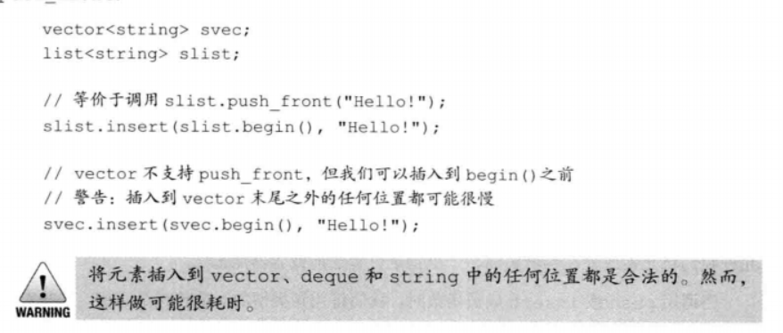

**插入范围**


**使用insert的返回值**


**使用emplace操作**

emplace相当于元素类型的构造函数


**练习**


```c++
#include <iostream>
#include <list>
#include <deque>

using namespace std;

int main() {
    list<int> ilist = {1, 2, 3, 4, 5, 6, 7, 8};     // 初始化 int 的 list
    deque<int> odd_d, even_d;

    // 遍历整数 list
    for (auto lb = ilist.cbegin(); lb != ilist.cend(); ++lb)
        if (*lb & 1)        // 查看最低位，1：奇数；0：偶数
            odd_d.push_back(*lb);
        else
            even_d.push_back(*lb);

    cout << "奇数值有：";
    for (auto db = odd_d.cbegin(); db != odd_d.cend(); ++db)
        cout << *db << " ";
    cout << endl;

    cout << "偶数值有：";
    for (auto db = even_d.cbegin(); db != even_d.cend(); ++db)
        cout << *db << " ";
    cout << endl;

    return 0;
}
Copy
// 运行结果
奇数值有：1 3 5 7 
偶数值有：2 4 6 8 

Process finished with exit code 0
```

##### 9.3.2 访问元素


**访问成员函数返回的是引用**

**下标操作和安全的随机访问**

at会抛出一个out_of_range异常

##### 9.3.3 删除元素


##### 9.3.4 特殊的forward_list操作


##### 9.3.5 改变容器大小


##### 9.3.6 容器操作可能使迭代器失效


**编写改变容器的循环程序**

insert和erase会返回


**不要保存end返回的迭代器**


#### 9.4 vector对象是如何增长的

**管理容量的成员函数**


**capacity和size**


#### 9.5 额外的string操作

##### 9.5.1 构造string的其他方法


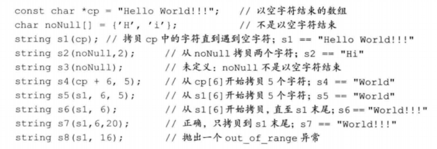

**substr**

返回一个string，是原来的部分或全部


**练习**


```c++
#include <iostream>
#include <vector>
#include <string>

using namespace std;

int main() {
    vector<char> cv = {'H', 'e', 'l', 'l', 'o'};
    string s(cv.data(), cv.size());
    cout << s << endl;

    return 0;
}
Copy
// 运行结果
Hello

Process finished with exit code 0
```

##### 9.5.2 改变string的其他方法


**append和replace函数**


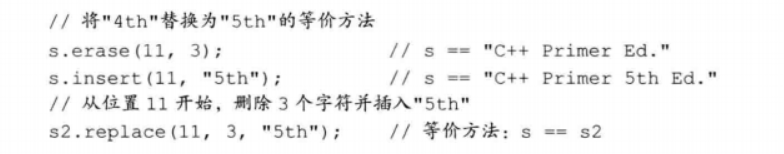

**改变string的多种重载函数**

##### 9.5.3 string搜索操作


**指定从哪里开始搜索**


**逆向搜索**


##### 9.5.4 compare函数


##### 9.5.5 数值转换


#### 9.6 容器适配器

stack queue priority_queue

**定义一个适配器**


**栈适配器**

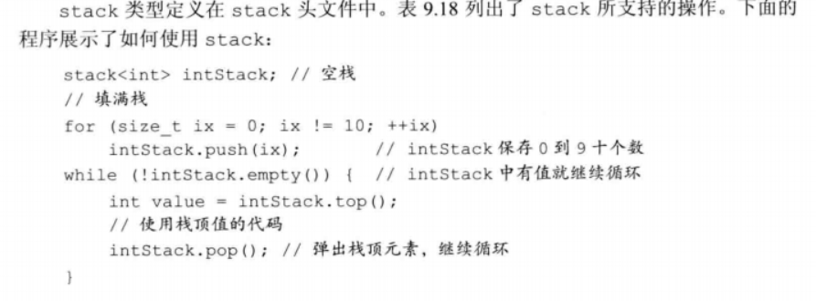

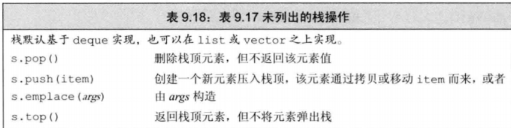

**队列适配器**


### 第十章 泛型算法


头文件algorithm

#### 10.1 概述

迭代器令算法不依赖于容器

**算法永远不会执行容器的操作**

#### 10.2初识泛型算法


##### 10.2.1 只读算法

`find`

`count`

`accumulate`

**算法和元素类型**

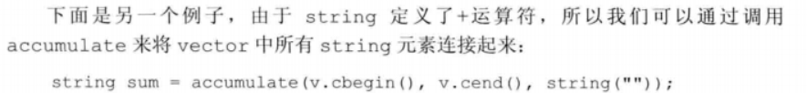


**操作两个序列的算法**

`equal`


##### 10.2.2 写容器元素的算法

`fill`


**算法不检查写操作**

`fill_n`假定安全，所以容易在空容器上调用

`back_inserter`


`copy`


##### 10.2.3 重拍容器元素的算法

`sort`

`unique`


#### 10.3定制操作

##### 10.3.1 向算法传递函数

谓词，第三个参数

**谓词**

一元谓词和二元谓词


##### 10.3.2 lambda表达式

**介绍lamda**


**向lambda传递参数**


**使用捕获列表**

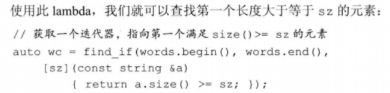


##### 10.3.3 lambda捕获和返回

**值捕获**

创建时捕获


**引用捕获**


**隐式捕获**

&或者=


**可变lambda**


**指定lambda返回类型**


##### 10.3.4 参数绑定


**标准库bind函数**

头文件`functional`


**使用placeholders名字**

名字_n都在这里面


**bind的参数**


**用bind重排参数顺序**


**绑定引用参数**


#### 10.4 再探迭代器

* 插入迭代器
* 流迭代器
* 反向迭代器
* 移动迭代器

##### 10.4.1 插入迭代器


##### 10.4.2 iostream迭代器

未看

##### 10.4.3 反向迭代器


#### 10.5 泛型算法结构


##### 10.5.1 5类迭代器


##### 10.5.2 算法形参模型


**接受单个目标迭代器的算法**


**接受第二个输入序列的算法**


##### 10.5.3 算法命名规范

**一些算法使用重载形式传递一个谓词**

**_if版本的算法**


**区分拷贝元素的版本和不拷贝的版本**


#### 10.6 特定容器算法


### 第十一章 关联容器

关联容器中的元素时按**关键字**来保存和访问的，顺序容器时按它们在容器中的位置来顺序保存和访问的

两个主要类型：`map`和`set`

`map`是关键字-值

`set`每个元素只包含一个关键字


##### 11.1 使用关联容器

map类似被称为关联数组

**使用map**


**使用set**


**练习**


```c++
#include <iostream>
#include <map>
#include <string>
#include <algorithm>

using namespace std;

string &trans(string &s) {
    for (int p = 0; p < s.size(); ++p) {
        if (s[p] >= 'A' && s[p] <= 'Z')
            s[p] += ('a' - 'A');
        else if (s[p] == ',' || s[p] == '.')
            s.erase(p, 1);
    }
    return s;
}

int main() {
    // 统计每个单词在输入中出现的次数
    map<string, size_t> word_count;     // string 到 size_t 的空 map
    string word;
    while (cin >> word)
        ++word_count[trans(word)];      // 提取 word 的计数器并将其加 1
    for (const auto &w : word_count)    // 对 map 中的每个元素
        // 打印结果
        cout << w.first << " occurs " << w.second
             << ((w.second > 1) ? " times" : " time") << endl;
    return 0;
}
Copy
// 运行结果
example. Cplusplus Primer example, Example primer
^D
cplusplus occurs 1 time
example occurs 3 times
primer occurs 2 times

Process finished with exit code 0
```

#### 11.2 关联容器概述

##### 11.2.1 定义关联容器


**初始化multimap或multiset**


##### 11.2.2 关键字类型的要求

**有序容器的关键字类型**


**使用关键字类型的比较函数**


##### 11.2.3 pair类型

头文件`utility`


**创建pair对象的函数**


#### 11.3 关联容器操作


##### 11.3.1 关联容器迭代器

解引用


**set的迭代器是const的**


**遍历关联容器**


**关联容器和算法**

通常不使用泛型算法


##### 11.3.2 添加元素


**向map添加元素**


**检测insert的返回值**


**向multiset或者multimap添加元素**


##### 11.3.3 删除元素

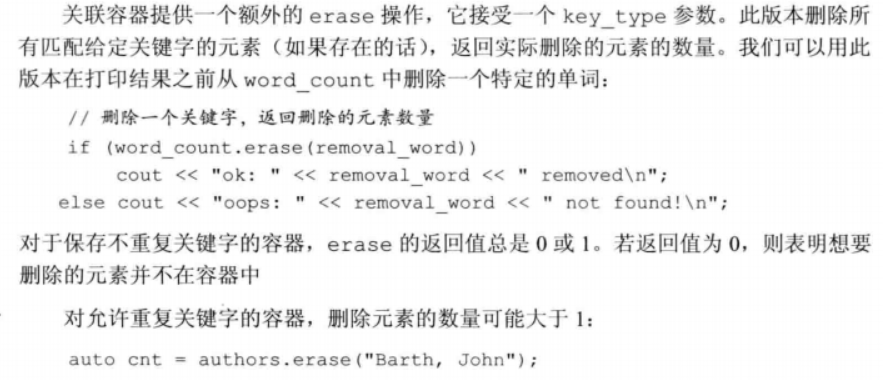


##### 11.3.4 map的下标操作


##### 11.3.5 访问元素


**对map使用find代替下标操作**


**在multimap后multiset中查找元素**


**一种不同的，面向迭代器的解决方法**


**equal_range**


##### 11.3.6 一个单词转换的map


**程序**


**建立转换映射**


**生成转换文本**


#### 11.4 无序容器


**使用无序容器**


**管理桶**


**无序容器对关键字类型的要求**


### 第12章 动态内存

自动

局部static对象在第一次使用前分配，程序结束时销毁

动态分配对象：标准库定义了两个智能指针类型来管理动态分配的对象


#### 12.1 动态内存与智能指针


##### 12.1.1 shared_ptr类


**使用**


**make_shared函数**


**shared_ptr的拷贝和赋值**


**shared_ptr自动销毁所管理的对象**

**析构函数**：引用技术变为0，就会销毁对象并释放内存

**还会自动释放相关联的内存**


**定义StrBlob类**


**构造函数**


**元素访问成员函数**


##### 12.1.2 直接管理内存

**使用new动态分配和初始化对象**


**动态分配const对象**


**内存耗尽**

会抛出一个类型为bad_alloc的异常

定义在头文件`new`


**释放动态内存**


**指针值和delete**


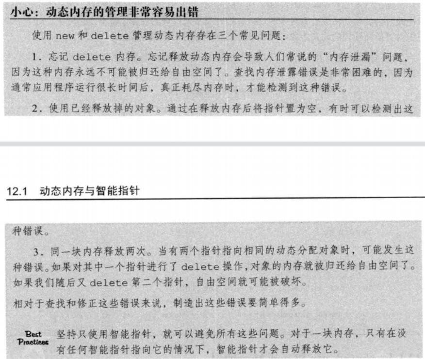

**delete之后重置指针值**

指针还存在**空悬指针**，未初始化指针。要么就在离开作用域时释放，要么就赋值nullptr

##### 12.1.3 shared_ptr和new结合使用


**不要混合使用普通指针和智能指针**


**也不要用get初始化另一个智能指针或赋值**


**其他shared_ptr操作**


##### 12.1.4 智能指针和异常


**智能指针和哑类**

**使用我们自己的释放操作**

deleter


##### 12.1.5 unique_ptr


**向unique_ptr传递删除器**


##### 12.1.6 weak_ptr


**检查指针类**

应用，还没看

#### 12.2 动态数组


##### 12.2.1 new和数组


**分配数组得到一个元素类型的指针**

不能用begin或者end，也不能用for


**初始化动态分配对象的数组**


**动态分配一个空数组是合法的**


**释放动态数组**


**智能指针和动态数组**


##### 12.2.2  allocator类


**allocator类**

头文件`memory`


**allocator分配未构造的内存**

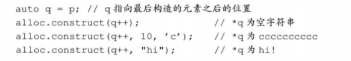


**拷贝和填充为初始化内存的算法**

两个伴随算法


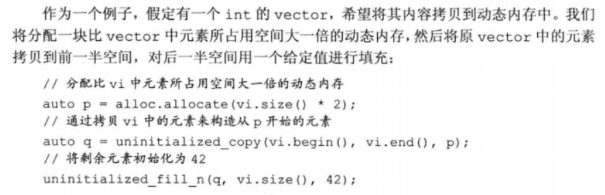

#### 12.3 使用标准库：文本查询程序

未看

## 第III部分 类设计者的工具

拷贝控制、重载运算符、继承和模板

### 第十三章 拷贝控制

拷贝构造函数、移动构造函数、拷贝赋值运算符、移动赋值运算符以及析构函数


#### 13.1 拷贝、赋值与销毁

拷贝构造函数、拷贝赋值运算符、析构函数

##### 13.1.1 拷贝构造函数


几乎都是const引用，不应该是explicit的

**合成拷贝构造函数**


**拷贝初始化**


**参数和返回值**


**拷贝初始化的限制**

**编译器可以绕过拷贝构造函数**

##### 13.1.2 拷贝赋值运算符


**重载赋值运算符**


**合成拷贝赋值运算符**


##### 13.1.3 析构函数


**析构函数完成什么工作**


**合成析构函数**


##### 13.1.4 三/五法则

不需要定义所有这些操作

**需要析构函数的类也需要拷贝和赋值操作**


**需要拷贝操作的类也需要赋值操作**，反之亦然

##### 13.1.5 使用=default

显示地使用合成版本


##### 13.1.5 阻止拷贝


**定义删除地函数**


**析构函数不能是删除地成员**


**private拷贝控制**


```c++
#include <iostream>
#include <string>

using namespace std;

class HasPtr {
public:
    HasPtr(const std::string &s = std::string()) :
            ps(new std::string(s)), i(0) { }
    HasPtr(const HasPtr &);                 // 拷贝构造函数
    HasPtr &operator=(const HasPtr &);      // 拷贝赋值运算符
    HasPtr &operator=(const string &);      // 赋予新 string
    string &operator*();                    // 解引用
    ~HasPtr();                              // 析构函数
private:
    std::string *ps;
    int i;
};

HasPtr::HasPtr(const HasPtr &orig) :
        ps(new std::string(*orig.ps)), i(orig.i) { }

HasPtr& HasPtr::operator=(const HasPtr &rhs) {
    std::string *newps = new std::string(*rhs.ps);  // 拷贝指针指向的对象
    delete ps;                                      // 销毁原 string
    ps = newps;                                     // 指向新 string
    i = rhs.i;                                      // 使用内置的 int 赋值
    return *this;                                   // 返回一个此对象的引用
}

HasPtr& HasPtr::operator=(const string &rhs) {
    *ps = rhs;
    return *this;
}

string& HasPtr::operator*() {
    return *ps;
}

HasPtr::~HasPtr() {
    delete ps;          // 释放 string 内存
}

int main() {
    HasPtr h("hi mom!");
    HasPtr h2(h);       // 行为类值，h2、h3 和 h 指向不同 string
    HasPtr h3 = h;
    h2 = "hi dad!";
    h3 = "hi son!";
    cout << "h: " << *h << endl;
    cout << "h2: " << *h2 << endl;
    cout << "h3: " << *h3 << endl;
    return 0;
}
Copy
// 运行结果
h: hi mom!
h2: hi dad!
h3: hi son!

Process finished with exit code 0
```


#### 13.2 拷贝控制和资源管理

##### 13.2.1 行为像值的类

#####  13.2.2定义行为向指针的类

有个记录使用次数的


#### 13.3 交换操作

swap


**在赋值运算中使用swap**


#### 13.4 拷贝控制示例

未看

#### 13.5 动态内存管理类

**StrVec类的设计**

**定义**


**使用construct**


**alloc_n_copy成员**


未看完

#### 13.6 对象移动

拷贝后就销毁，移动的性能会更好

新标准的一个最主要特性


##### 13.6.1 右值引用

&&


**左值持久，右值短暂**


**变量是左值**


**标准库move函数**

显示转换


##### 13.6.2 移动构造函数和移动赋值运算符

移动构造函数第一个参数是右值引用


**移动操作、标准库容器和异常**


**移动赋值运算符**


**移后源对象必须可析构**

**合成的移动操作**

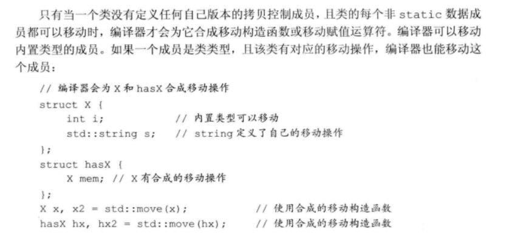

后面还没看

##### 13.6.3 右值引用和成员函数


后面还没看

### 第14章 重载运算与类型转换

#### 14.1 基本概念


**直接调用一个重载的运算符函数**


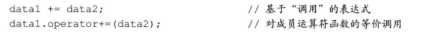

**某些运算符不应该被重载**


**使用与内置类型一致的含义**

**赋值和复合赋值运算符**

**选择作为成员或者非成员**


#### 14.2 输入和输出运算符

##### 14.2.1 重载输出运算符<<


**输出运算符尽量减少格式化操作**


**输入输出运算符必须是非成员函数**

friend

##### 14.2.2 重载输入运算符>>


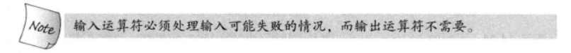


#### 14.3 算术和关系运算符

非成员函数


##### 14.3.1 相等运算符


##### 14.3.2 关系运算符

#### 14.4 赋值运算符

除了拷贝、移动之外的第三种


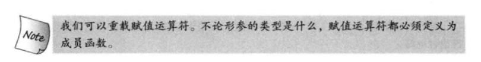

**复合赋值运算符**


#### 14.5 下标运算符

必须是成员函数


#### 14.6 递增和递减运算符


**前置**


**后置**

int类型的形参


**显示调用后置运算符**

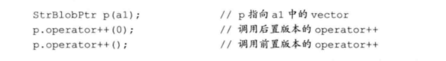

#### 14.7 成员访问运算符

解引用*和箭头运算符->


**对箭头运算符返回值的限定**


#### 14.8 函数调用运算符

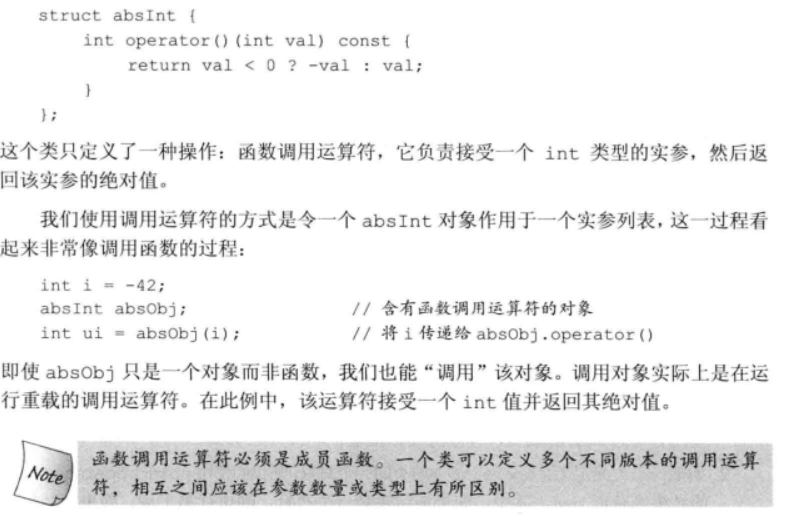

**含有状态的函数对象类**


##### 14.8.1 lambda是函数对象

##### 14.8.2 标准库定义的函数对象


##### 14.8.3 可调用对象与function

还没看

#### 14.9 重载、类型转换与运算符

转换构造函数和类型转换运算符

##### 14.9.1 类型转换运算符

```
operator type() const;
```


**定义含有类型转换运算符的类**


避免过度使用

**显示的类型转换运算符**


##### 14.9.2 避免由二义性的类型转换

##### 14.9.3 函数匹配与重载运算符

### 第十五章 面向对象程序设计

#### 15.1 OOP:概述

数据抽象 继承和动态绑定

继承：基类和派生类

虚函数：派生类适应自身的版本

动态绑定，用的是基类还是派生类取决于运行时的绑定


#### 15.2 定义基类和派生类

##### 15.2.1 定义基类


**成员函数与继承**

需要覆盖的用虚函数动态绑定

**访问控制与继承**

派生类能访问共有成员和受保护的成员，不能访问私有成员

##### 15.2.2 定义派生类

**类派生列表**

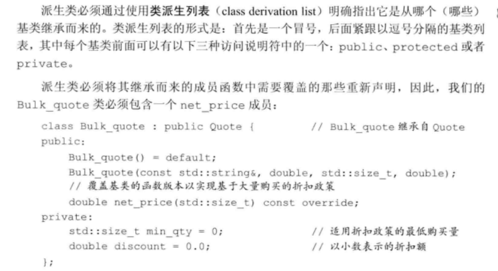

大多数类都只继承自一个类，**单继承**

**派生类中的虚函数**


**派生类对象及派生类向基类的类型转换**

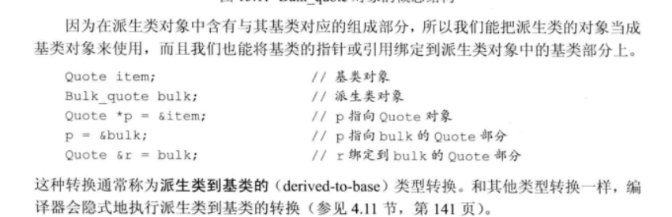

**派生类构造函数**

派生类要使用基类的构造函数来初始化基类部分


**派生类使用基类的成员**


**派生类的声明**


**被用作基类的类**


**防止继承的发生**

final


##### 15.2.3 类型转换与继承

基类和派生类的转换


**静态类型与动态类型**

未看

#### 15.3 虚函数


**对虚函数的调用可能在运行时才被解析**


**派生类中的虚函数**


**final和override说明符**


**虚函数与默认实参**


**回避虚函数的机制**


#### 15.4 抽象基类

**纯虚函数**


**含有纯虚函数的类时抽象基类**

不能直接创建一个抽象基类对象，可以派生，但是必须覆盖这个纯虚函数


#### 15.5 访问控制与继承

**受保护的成员**


**公有、私有和受保护继承**


**派生类向基类转换的可访问性**


**友元与继承**


**改变个别成员的可访问性**


**默认的继承保护级别**


#### 15.6 继承中的类作用域

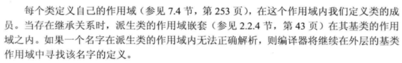


**在编译时进行名字查找**


**名字冲突与继承**

派生类的成员将隐藏同名的基类成员

**通过作用域运算符来使用被隐藏的成员**


后面还没看

#### 15.7 构造函数与拷贝控制

##### 15.7.1 虚析构函数

基类通常定义一个虚析构函数


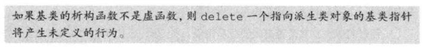

**虚析构函数将阻止合成移动操作**

**15.7.2 合成拷贝控制与继承**

##### 15.7.3 派生类的拷贝控制成员


**定义派生类的拷贝或移动构造函数**


**派生类赋值运算符**

需要显式的赋值


**派生类析构函数**


##### 15.7.4 继承的构造函数


**继承的构造函数的特点**

不会改变 访问等级，不管using声明出现在哪里，基类是public就是public，private也是如此

#### 15.8 容器与继承


**在容器中放置(指针)而非对象**


#### 15.9 文本查询程序再探

### 第十六章 模板与泛型编程

#### 16.1 定义模板

##### 16.1.1 函数模板


模板参数可以逗号分隔开

**实例化函数模板**


**模板类型参数**

可以用来指定返回类型或函数的参数类型，变量声明或类型转换

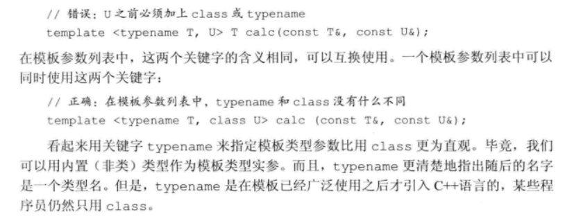

**非类型模板参数**

表示一个值而不是类型


**inline和constexpr的函数模板**


##### 16.1.2 类模板

**定义类模板**


**实例化类模板**

**显示模板实参**


**在模板作用域中引用模板类型**

**类模板的成员函数**


**check和元素访问成员**


之后还没看

##### 16.1.3 模板参数


**模板参数与作用域**


**模板声明**


##### 16.1.4 成员模板

**普通类的成员模板**


**类模板的成员函数**


##### 16.1.5 控制实例化


##### 16.1.6 效率与灵活性

#### 16.2 模板实参推断

##### 16.2.1 类型转换与模板类型参数


#### 16.3 重载与模板

#### 16.4 可变参数模板

#### 16.5 模板特例化

