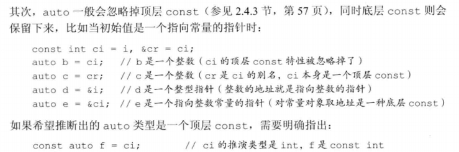
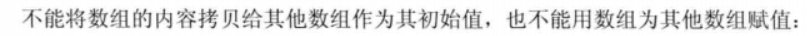
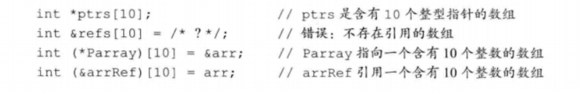
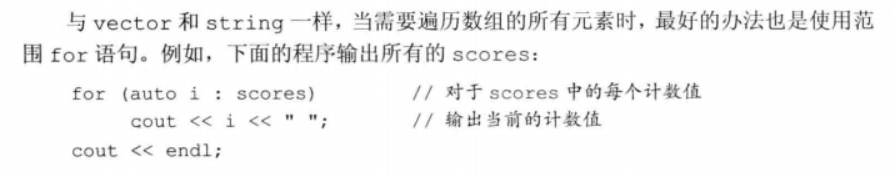

# C++_primer

[TOC]


## 第一部分	基本语言

### 第一章 快速入门


### 第二章 变量和基本类型

#### 2.1 基本内置类型


##### 2.1.1 算数类型

**整型**

**整型**：整数、字符、布尔型

带符号和无符号类型（signed、unsigned），**默认带符号**。unsigned后不加，意味着unsigned int

```
#取值越界                                                                                                                          无符号
例如：8位的unsigned char，取值范围是0~255，则数字对2^8 = 256取模，负数也是取模，如-1取模是255
有符号由编译器决定
```

**浮点型**

float一个字，6位有效数字

double两个字，至少10位有效数字

```
#建议
unsigned比较好，避免越界出现负数
很少用short
char尽量不要用来计算
用int比较好，不管是出错或者是性能
浮点就用double
```

##### 2.1.2 类型转换

自动类型转换

有符号会转换成无符号

`sizeof`可以看有多少个字节

##### 2.1.3 字面值常量

**1.整型字面值和浮点字面值**

20：10进制	024：8进制	0x14：十六进制

后面增加l或L，强制转化为long，用L；加U则unsigned；如1024UL


3.14159E0F

E是指数，F单精度，默认double

**3.布尔字面值、字符字面值和字符串字面值**

true和false

‘a' 单引号，L’a' wchar_t

“Hello World”


**4.非打印字符的转义序列**

```
\n	换行
\t
\r	回车
后面的是当你用到这些符号的时候
\\
\'
\?
\''
```

**5.字符串字面值**

"",会在字符串字面值加个空字符’\0‘

```
#字符串字面值连接
空格、制表符或者换行符分开最后都会连接
```


```
#用反斜线\就可以连接任何东西，不允许有任何东西
```


#### 2.2 变量

C++是一种静态类型语言，编译时会检查类型，所以需要先定义变量的类型

##### 2.2.1 什么是变量

**左值和右值：**左值可以出现在赋值语句的左边或者右边，右值只能出现在右边

**对象：**对象是内存中具有类型的区域

##### 2.2.2 变量名

变量的标识符，**字母、数字、下划线**，变量必须以字母或者下划线开头而且区分大小写

**1.C++关键字**


**2.变量命名习惯**

* 一般用小写字母
* 提示用法
* 每个词之间添加下划线：student_loan或者内嵌的词第一个字母都大写：studentLoan

##### 2.2.3 定义对象

类型说明符 变量名；

**1.初始化**

* 复制初始化 =
* 直接初始化()
* 列表初始化={} **列表初始化没有类型转换，所以里面必须是相应类型的**

**2.使用多个初始化式**

内置类型没区别

类类型有些初始化只能用直接初始化，**构造函数**，多个初始化式时不能用复制初始化

**3.初始化多个变量**

##### 2.2.4 变量初始化规则

**1.内置类型变量的初始化**

取决于变量定义的位置，函数体外为零，体里的不进行自动初始化（包括int）

**2.类类型变量的初始化**

构造函数控制初始化

没提供就会有**默认构造函数**

##### 2.2.5 声明和定义

**定义**：分配存储空间，指定初始值

**声明**：表明变量的类型和名字，定义也是声明。可以使用extern关键字声明


这时候是一个全局变量

##### 2.2.6 名字的作用域

用花括号界定

* 全局作用域：函数外部的名字
* 局部作用域：
* 语句作用域：比如for语句中

**作用域可嵌套**

##### 2.2.7 在变量使用处定义变量

通常把一个对象定义在首次使用的地方

#### 2.3 复合类型


##### 2.3.1 引用

引用就是别名，主要用作函数的形式参数，必须初始化


**1.引用是别名**

**2.定义多个引用**

**3.const 引用**


##### 2.3.2 指针


**定义**


**获取地址**


**利用指针访问对象**


**空指针**


**初始化所有指针，实在不清楚就`nullptr`**

**`void*`指针**


##### 2.3.4 理解复合类型的声明


**指向指针的指针**


**指向指针的引用**


#### 2.4 const限定符


#### 1.定义const对象

```
const int i = 0; //必须初始化
```

#### 2.const对象默认为文件的局部变量

想要别的用，要提前加extern

##### 2.4.1 const的引用

常量的引用必须是const的引用，但是const引用的对象不一定是个常量，所以这个常量有可能通过其他途径修改


##### 2.4.2 指针和const

**指向常量的指针**

和const的引用一样，但是指针可以改变指向的对象


**const 指针**

`*const` 必须初始化，指针不可以改变指向的对象，但是可以改变指向对象的值


##### 2.4.3 顶层const


##### 2.4.4 constexpr和常量表达式

#### 2.5 处理类型

##### 2.5.1 类型别名

 **typedef名字**

类型同义词


**using**


##### 2.5.2 auto类型说明符


auto会忽略顶层const，保留底层const



##### 2.5.3 decltype类型指示符


### 2.7 enum枚举


#### 2.8 类类型

#### 1.从操作开始设计类

接口和实现


#### 2.定义类


注意最后的分号

#### 3.类的数据成员

#### 4.访问标号

public和private

public可以在程序的任何部分访问

private只能被类的组成部分访问或者是该类的友元

#### 5.使用struct关键字

成员都是默认public，class默认为private

#### 2.9 编写自己的头文件

header file

#### 2.9.1设计自己的头文件


##### 1.头文件用于声明而不是用于定义


##### 2.一些const对象定义在头文件中

常量表达式初始化的const对象

#### 2.9.2 预处理器的简单介绍

#include是预处理器的一部分

##### 1. 头文件经常需要其他头文件

文件保护符

##### 2.避免多重包含

为了避免名字冲突，所以用全大写字母


##### 3.使用自定义的头文件


“” 认为是非系统头文件，查找通常开始于源文件所在的路径

### 第三章 字符串、向量和数组

#### 3.1 命名空间的using声明

作用域操作符 `::`

`using namespace::std`

`using std::cin`


**1.每个名字都需要一个using声明**

**2.使用标准库类型的类定义**

**3.头文件不应该包含using声明**

**习题**


```c++
#include <iostream>

using std::cin;
using std::cout;
using std::endl;

int main()
{
	int base, exponent;
    int result = 1;
    
    cout << "Enter base and exponent: " << endl;
    cin >> base >> exponent;
    
    if(exponent < 0){
        cout << "Exponent must be bigger than 0" << endl;
        return -1;
    } else {
        for(int cnt = 0; cnt < exponent; ++ cnt){
			result *= base;
        }
    }
    
    cout << "Result = " << result << endl;
    return 0;
}
```

#### 3.2 标准库string类型

长度可变的字符串

`#include <iostream>`

`using std::string`

##### 3.2.1 string对象的定义和初始化


##### 3.2.2 string对象的读写


**1.读入未知数目的string对象**

`while(cin >> word){}`

**2.用getline读取整行文本**

```c++
 string line;
 while(getline(cin, line)) #getline会丢弃输入时的换行符
        cout << s4 << endl;
```

##### 3.2.3 string对象的操作


**2.string::size_type类型**

s.size()返回的类型是string::size_type类型，而不是int，所以返回值不要赋给一个int对象。**C++11**中推荐用`auto`或者`decltype`

**3.string关系操作符**

比较大小是按照字典顺序的

**6.和字符串字面值连接**

左右操作数至少有一个需要是string


**7.获取字符**


**8.下标操作可用作左值**

##### 3.2.4 string对象中字符的处理


**习题**


```c++
#include <iostream>
#include <string>
#include <cctype>
using namespace std;

int main()
{
    string s1;
    string s2;

    cout << "Enter two string: ";
    cin >> s1 >> s2;

    if(s1 == s2)
        cout << "s1 == s2" << endl;
    else if(s1 > s2)
        cout << "s1 > s2" << endl;
    else
        cout << "s1 < s2" << endl;
    return 0;
}

int main()
{
    string s1;
    string s2;

    cout << "Enter two string: ";
    cin >> s1 >> s2;

    if(s1.size() == s2.size())
        cout << "s1 == s2" << endl;
    else if(s1.size() > s2.size())
        cout << "s1 > s2" << endl;
    else
        cout << "s1 < s2" << endl;
    return 0;
}
```


```c++
#include <iostream>
#include <string>
#include <cctype>
using namespace std;

int main()
{
    string s;
    string result;

    cin >> s;
    result = s;
    while(cin >> s){
        if(s != "EOF")
            result += ' ' + s;
        else
            break;
    }
    cout << result << endl;
    return 0;
}
```


```c++
#include <iostream>
#include <string>
#include <cctype>
using namespace std;

int main()
{
    string s;
    string result;

    cout << "Enter string with punct: ";
    cin >> s;

    for(string::size_type idx = 0; idx != s.size(); ++ idx){
        if(!ispunct(s[idx]))
            result += s[idx];
    }
    if(result.size() == s.size()){
        cout << "Enter wrong string" << endl;
        return -1;
    }
    else
        cout << result << endl;
    return 0;
}
```

#### 3.3 标准库vector类型

vector是同一种类型的对象的集合

```
#include <vector>
using std::vector;
```


##### 3.3.1 vector对象的定义和初始化


**1.创建确定个数的元素**


所以最好先创建空的，然后动态增加元素

**列表初始化**


**2.值初始化**


##### 3.3.2 vector对象的操作


**1.vector对象的size**

`vector<int>::size_type`

**2.向vector添加元素**


**下标操作不会添加元素，只能用push_back**

**习题**


```c++
#include <iostream>
#include <string>
#include <cctype>
#include <vector>
using namespace std;

int main()
{
    vector<int> ivec;
    int num;
    while(cin >> num)
        ivec.push_back(num);
    if(ivec.size() == 0){
        cout << "Error" << endl;
        return -1;
    }

    for(vector<int>::size_type idx = 0; idx < ivec.size() - 1; idx += 2)
        cout <<ivec[idx] + ivec[idx + 1] << endl;

    if(ivec.size() % 2 == 1)
        cout << ivec[ivec.size() - 1] << endl;
    return 0;
}

int main()
{
    vector<int> ivec;
    int num;
    while(cin >> num)
        ivec.push_back(num);
    if(ivec.size() == 0){
        cout << "Error" << endl;
        return -1;
    }

    for(vector<int>::size_type idx = 0; idx < ivec.size() / 2; idx += 1)
        cout <<ivec[idx] + ivec[ivec.size() - idx - 1] << endl;

    if(ivec.size() % 2 == 1)
        cout << ivec[ivec.size() / 2] << endl;
    return 0;
}
```


```c++
#include <iostream>
#include <string>
#include <cctype>
#include <vector>
using namespace std;

int main()
{
    vector<string> svec;
    string s1;

    while(cin >> s1)
        svec.push_back(s1);

    for(vector<string>::size_type idx = 0; idx != svec.size(); ++ idx){
        for(string::size_type idy = 0; idy != svec[idx].size(); ++ idy)
            svec[idx][idy] = toupper(svec[idx][idy]);
        cout << svec[idx] << '\t';
        if(idx % 8 == 7)
                cout << endl;
    }
    return 0;
}
```

#### 3.4 迭代器简介

另一种访问`vector`对象的元素的方法，`iterator`

**1.容器的iterator类型**

`vector<int>::iterator iter;`

**2.begin 和 end操作**


`vector<int>::iterator iter = ivec.begin();`


**3.vector迭代器的自增和解引用运算**


**5.程序示例**


c++11中修改为`auto`也可以，begin和end

**6.const_iterator**

只能读取，不能改变值，这个可以++iter

如果是const vector::iterator 就不可以++iter

**习题**


```c++
#include <iostream>
#include <string>
#include <cctype>
#include <vector>
using namespace std;

int main()
{
    vector<int> ivec;
    int n1;

    while(cin >> n1)
        ivec.push_back(n1);

    vector<int>::iterator iter;
    for(iter = ivec.begin(); iter < ivec.end() - 1; iter += 2)
        cout << *iter + *(iter + 1) << endl;

    if(ivec.size() % 2 == 1)
        cout << *iter << endl;
    return 0;
}

int main()
{
    vector<int> ivec;
    int n1;

    while(cin >> n1)
        ivec.push_back(n1);

    vector<int>::iterator first;
    vector<int>::iterator last;
    for(first = ivec.begin(), last = ivec.end() - 1; first < last; ++first, --last)
        cout << *first + *last << endl;

    if(first == last)
        cout << *first << endl;
    return 0;
}
```


```c++
#include <iostream>
#include <string>
#include <cctype>
#include <vector>
using namespace std;

int main()
{
    vector<string> svec;
    string s1;

    while(cin >> s1)
        svec.push_back(s1);

    int count = 0;
    for(vector<string>::iterator iter = svec.begin(); iter != svec.end(); iter ++){
        for(string::size_type idx = 0; idx != (*iter).size(); ++idx)
            (*iter)[idx] = toupper((*iter)[idx]);
        cout << *iter + ' ';
        if((count + 1) % 8 == 0)
            cout << endl;
        count ++;
    }
    return 0;
}
```


```c++
#include <iostream>
#include <string>
#include <cctype>
#include <vector>
using namespace std;

int main()
{
    vector<int> ivec(10, 10);

    for(vector<int>::iterator iter = ivec.begin(); iter != ivec.end(); ++iter){
        *iter *= 2;
        cout << *iter << endl;
    }
    return 0;
}c
```

**迭代器的算数操作**

* `iter + n`
* `iter1 - iter2`


#### 3.5 标准库bitset类型


```
#include <bitset>
using std::bitset
```

##### 3.5.1 bitset对象的定义和初始化


**1.unsigned值**


**2.string**


##### 3.5.2 bitset对象上的操作


#### 3.5 数组

如果不清楚元素的确切个数，使用vector。设计良好的程序只在强调速度时才在类实现的内部使用数组和指针。

##### 3.5.1 定义和初始化内置数组


**显式初始化数组元素**


**字符数组的特殊性**


**不允许拷贝和复制**



**理解复杂的数组声明**（由内向外，由右到左）




##### 3.5.2 访问数组元素



##### 3.5.3 指针和数组


**指针也是迭代器**


**begin和end**


**指针运算**

指向数组的指针运算和迭代器一样

pt[2]

*(pt + 2)


##### 3.5.4 C风格字符串

也就是cstring


最好不要用

##### 3.5.5 与旧代码接口

**混用string和C**


**使用数组初始化vector对象**


#### 3.6 多维数组


**初始化**


**多维数组的下标引用**

**使用for语句处理**


使用引用是为了避免数组呗自动转换成指针


**指针和多维数组**


**类型别名**


**练习**


```c++
#include <iostream>
#include <string>
#include <cctype>
#include <vector>
using namespace std;

int main()
{
    int arr[3][4] = {1, 2, 3, 4, 5};

    for(int (&row)[4] : arr){
        for(int &col : row)
            cout << col << " ";
        cout << endl;
    }
    cout << endl;

    for(size_t i = 0; i < 3; ++i){
        for(size_t j = 0; j < 4; ++j)
            cout << arr[i][j] << " ";
        cout << endl;
    }

    cout << endl;
    for(int (*p)[4] = begin(arr); p != end(arr); ++p){
        for(int *q = begin(*p); q != end(*p); ++q)
            cout << *q << " ";
        cout << endl;
    }
    return 0;
}
```

**类型别名**

```c++
#include <iostream>
#include <string>
#include <cctype>
#include <vector>
using namespace std;

using int_4 = int[4];
int main()
{
    int arr[3][4] = {1, 2, 3, 4, 5};

    for(int_4 &row : arr){
        for(int &col : row)
            cout << col << " ";
        cout << endl;
    }
    cout << endl;

    for(size_t i = 0; i < 3; ++i){
        for(size_t j = 0; j < 4; ++j)
            cout << arr[i][j] << " ";
        cout << endl;
    }

    cout << endl;
    for(int_4 *p = begin(arr); p != end(arr); ++p){
        for(int *q = begin(*p); q != end(*p); ++q)
            cout << *q << " ";
        cout << endl;
    }
    return 0;
}

```

### 第四章 表达式

表达式由一个或多个运算对象(operand)组成,对表达式求值将得到一个结果(result).·字面值和变量是最简单的表达式(expression),其结果就是字面值和变量的值。把一个运算符(operator)和一个或多个运算对象组合起来可以生成较复杂的表达式。

#### 4.1 基础

##### 4.1.1 基本概念

一元运算符 & *

二元运算符 + - * /

**重载运算符**

**左值和右值**

左值可以在左边，右值不可以

##### 4.1.2 优先级和结合律

page147

##### 4.1.3 求值顺序

没有规定，取决于编译器


#### 4.2 算术运算符

bool除了0都会被转化为true

余数直接丢弃，向0取整，**取余**结果可以先看除法的结果


#### 4.3 逻辑和关系运算符

&& 和 || 短路求值，算左再算右


#### 4.4 赋值运算符

可以用初始值列表赋值

满足右结合律


**复合赋值运算符**


#### 4.5 递增和递减运算符


除非必须，否则不用后置版本


#### 4.6 成员访问运算符

点运算符和箭头运算符

ptr->mem 等价于 （*ptr）.mem


合法：a d f

#### 4.7 条件运算符

?:

`cond?expr1:expr2`


**练习：**


```c++
int main()
{
    vector<int> ivec = {1, 2, 3, 4, 5};

    for(auto &val : ivec)
        val = (val % 2 == 1) ? val * 2 : val;

    for(auto val : ivec)
        cout << val << " ";

    return 0;
}
```


```c++
#include <iostream>
#include <string>
#include <cctype>
#include <vector>
using namespace std;

int main()
{
    string final_grade;
    int grade;

    while(cin >> grade && grade >= 0 && grade <= 100){
        final_grade = (grade > 90) ? "High pass"
                    : (grade > 75) ? "pass"
                    : (grade > 60) ? "Low pass" : "Fail";
        cout << final_grade << endl;
    }
    return 0;
}
```

#### 4.8 位运算符


#### 4.9 sizeof运算符


#### 4.10 逗号运算符


条件运算符优先级比逗号要高

#### 4.11 类型转换

**隐式转换**

##### 4.11.1 算术转换

转换成最宽的类型

首先会做整型提升，小整数类型转换成大整数类型，char变int

然后再做转换


##### 4.11.2 其他隐式类型转换

**数组转换成指针**

##### 4.11.3 显示转换

强制类型转换


`static_cast`

只要不包含底层const


`const_cast`


`reinterpret_cast`


**练习**


#### 4.12 运算符优先级表

### 第五章 语句

#### 5.1 简单语句

; 空语句

**复合语句**

#### 5.2 语句作用域

**练习**


#### 5.3 条件语句

`if`和`switch`

##### 5.3.1 if语句

```c++
if ()
	;
else if ()
	;
```


**练习**


```c++
#include <iostream>
#include <vector>
#include <string>

using namespace std;

int main() {
    int grade;
    cout << "请输入您的成绩：" << endl;
    cin >> grade;
    if (grade < 0 || grade > 100) {
        cout << "该成绩不合法" << endl;
        return -1;
    }
    if (grade == 100) {                             // 处理满分的情况
        cout << "等级成绩是：" << "A++" << endl;
        return 0;
    }
    const vector<string> scores = {"F", "D", "C", "B", "A"};
    string lettergrade;
    // 如果成绩不合格，不需要考虑添加加号减号的问题
    if (grade < 60)
        lettergrade = scores[0];
    else {
        lettergrade = scores[(grade - 50) / 10];    // 获得字母形式的成绩
        if (grade != 100)       // 只要不是 A++，就考虑添加加号减号
            if (grade % 10 > 7)
                lettergrade += '+';     // 末尾是 8 或者 9 的成绩添加一个加号
            else if (grade % 10 < 3)
                lettergrade += '-';     // 末尾是 0、1 或者 2 的成绩添加一个减号
    }
    cout << "等级成绩是：" << lettergrade << endl;

    return 0;
}
```

##### 5.3.2 switch语句


**练习**


```c++
#include <iostream>

using namespace std;

int main() {
    unsigned int vowelCnt = 0;
    char ch;
    cout << "请输入一段文本：" << endl;
    while (cin >> ch && ch != 'Q') {
        if (ch == 'a' || ch == 'e' || ch == 'i' || ch == 'o' || ch == 'u')
            ++vowelCnt;
    }
    cout << "您输入的文本中共有 " << vowelCnt << " 个元音字母" << endl;

    return 0;
}
```


```c++
#include <iostream>
#include <string>
#include <cctype>
#include <vector>
using namespace std;

int main()
{
    unsigned int ff_cnt = 0, fl_cnt = 0, fi_cnt = 0;
    char ch, prech = '\0';
    cout << "请输入一段文本：" << endl;
    while (cin >> noskipws >> ch)
    {
        switch (ch)
        {
        case 'f':
            if (prech == 'f')
                ++ ff_cnt;
            break;
        case 'l':
            if (prech == 'f')
                ++ fl_cnt;
            break;
        case 'i':
            if (prech == 'f')
                ++ fi_cnt;
            break;
        }
        prech = ch;
    }
    cout << "ff 的数量是：" << ff_cnt << endl;
    cout << "fl 的数量是：" << fl_cnt << endl;
    cout << "fi 的数量是：" << fi_cnt << endl;

    return 0;
}
```

**case 标签必须是整型常量表达式**

#### 5.4 迭代语句

循环 

循环前检查条件：`while`和`for`

先执行循环体：`do while`

##### 5.4.1 while语句

```c++
while (condition)
	statement
```

1）不清楚迭代几次的时候。2）循环结束后访问循环控制变量


**练习**

```c++
int main()
{
    string s;
    string pres = "/0";
    string max_s;
    unsigned max_cnt = 1;
    unsigned temp_cnt = 1;
    while(cin >> s)
    {
        if(s == pres)
        {
            ++ temp_cnt;
            if (temp_cnt >= max_cnt){
                max_cnt = temp_cnt;
                max_s = s;
            }

        }
        else
            temp_cnt = 1;
        pres = s;
    }

    if (max_cnt == 1)
        cout << "没有连续出现过" << endl;
    else
        cout << max_s << "出现过" << max_cnt << endl;

    return 0;
}

int main()
{
	pair<string, int> max_duplicated;
	int cnt;

	for(string str, prestr; cin >> str; prestr = str)
    {
        if (str == prestr)
            ++cnt;
        else
            cnt = 0;
        if (cnt > max_duplicated.second)
            max_duplicated = {str, cnt};
    }

    if (max_duplicated.second == 1)
        cout << "No duplication" << endl;
    else
        cout << max_duplicated.first << " occurs " << max_duplicated.second + 1 << " times " << endl;

	return 0;
}
```

#### 5.4.2 传统的for语句

```c++
for (init-statemen; condition; expression) // 先执行init-statement，判断condition
	statement
```

**for语句头中的多重定义**

`init-statement`只能有一条声明语句，因此，所有变量的基础类型必须相同

**省略for语句头的某些部分**

任何一个都可以被空语句替换

**练习**


```c++
#include <iostream>
#include <vector>

using std::cout; using std::vector;

bool is_prefix(const vector<int>& lhs, const vector<int>& rhs)
{
	if (lhs.size() > rhs.size())
		return is_prefix(rhs, lhs);
	for (unsigned i = 0; i != lhs.size(); ++i)
		if (lhs[i] != rhs[i]) 
			return false;
	return true;
}

int main()
{
	vector<int> l{ 0, 1, 1, 2 };
	vector<int> r{ 0, 1, 1, 2, 3, 5, 8 };
	cout << (is_prefix(r, l) ? "yes\n" : "no\n");

	return 0;
}
```

