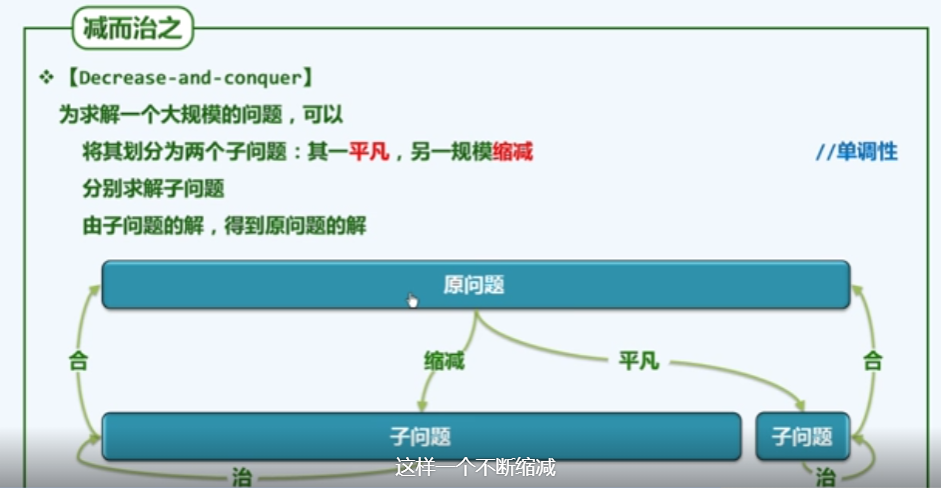
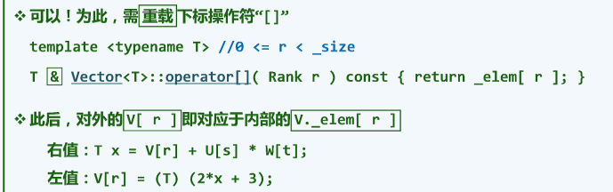
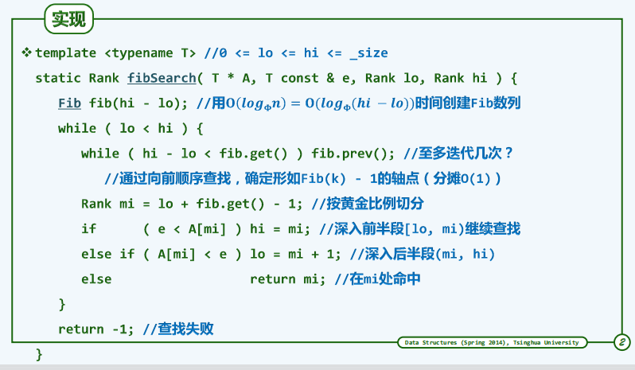
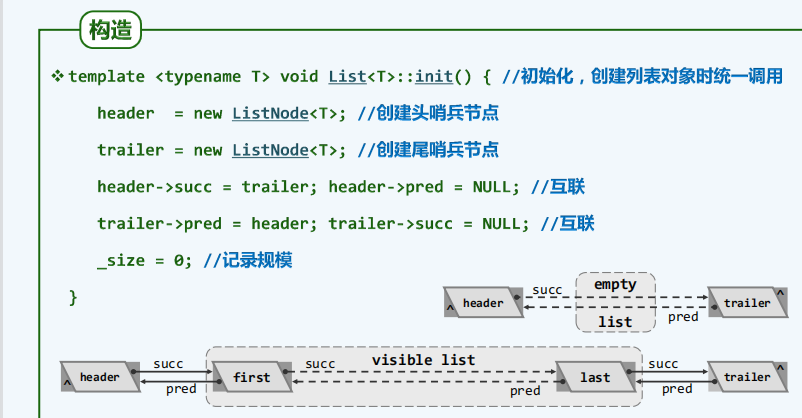
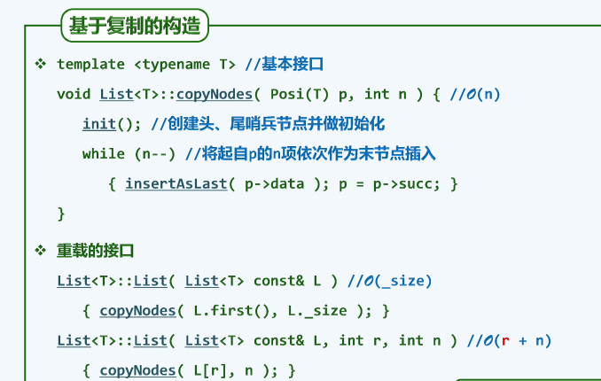
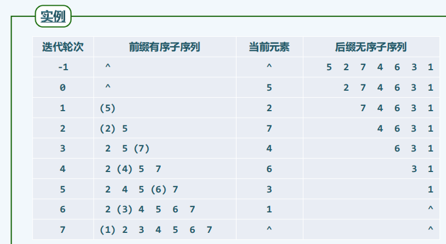

# Data_structure

[TOC]

## 第一章 绪论（上）

### (b)计算模型

#### 01b-1: 性能测度

效率：DSA

度量

#### 01b-2: 问题规模

算法分析：正确性和成本（**运行时间**+存储空间）

问题实例的**规模**，往往是决定计算成本的问题

#### 01b-3: 最坏情况

T(n)

#### 01b-4: 理想模型

实验统计不行

抽象理想平台

#### 01b-5 & 6: 图灵机 & 实例 TM

#### 01b-7: RAM模型 & 实例

random access machine

算法的运行时间 算法需要执行的基本操作次数

### (c)大O记号

#### 01c-1: 主流长远

#### 01c-2: 大O记号

O：上界

Ω：下界（最好情况）

#### 01c-3: 高效解

逐渐复杂

O(1)

O((logn)^c)

#### 01c-4 : 有效解

令人满意

O(n^c)

#### 01c-5 : 难解

无效算法

O(2^n)

#### 01c-6: 2−Subset

Np-complete 不是多项式可以解决的问题

#### 01c-7: 增长速度

## 第二章 绪论（下）

### (d)算法分析

#### 01d-1: 算法分析

正确性（不变性 x 单调性） + 复杂度

主要方法：

迭代：级数求和

递归：递归跟踪 + 递推方程

猜测 + 验证

#### 01d-2: 级数

#### 01d-3: 循环

O(n^2)

O(n^2)

#### 01d-5: 正确性的证明

#### 01d-6: 封底估算-1 -2

近似估计，定性

三生三世 10^10 

一天 10^5

计算机 1Ghz 10^9

### (e)递归与迭代

#### 01-E-1: 迭代与递归

#### 01-E-2: 减而治之

#### 01-E-3: 递归跟踪

简单递归的分析

#### 01-E-4: 递推方程

#### 01-E-5: 数组倒置

#### 01-E-6: 分而治之

#### 01-E-7: 二分递归：数组求和

### （xc）动态规划

#### 01XC-1: 动态规划

递归获得规律然后转化为迭代

#### 01XC-2: Fib()：递推方程

O(2^n)

#### 01XC-3: Fib()：封底估算

可以得到大概的时间

#### 01XC-4: Fib()：递归跟踪

递归实例被大量重复使用

#### 01XC-5: Fib()：迭代

由自顶向下递归，变为自底向上迭代

#### 01XC-6: 最长公共子序列

LCS

#### 01XC-7: LCS：递归

## 第二章 向量（上）

### (a)接口与实现

#### 02A-1 接口与实现

线性序列：vector和list

1）ADT/实现

2）算法

抽象数据类型 = 数据模型 +  操作

数据结构 = 基于特定语言，实现ADT的一整套算法

#### 02A-2 向量ADT

向量是数组的抽象和泛化，元素的类型不限于基本类型

search是有向序列，不超过e的最大的值

#### 02A-3 接口操作实例

#### 02A-4 构造与析构

Vector模板类

#### 02A-5 复制

### （b）可扩充向量

#### 02B-1 可扩充向量

#### 02B-2 动态空间管理

 

#### 02B-3 递增式扩容

每I次都需要扩容，相当于每次扩容的成本为O(n)

#### 02B-4 加倍式扩容

O(1)

#### 02B-5 分摊复杂度

### （c）无序向量

#### 02C-1 概述

#### 02C-2: 循秩访问

元素访问

#### 02C-3 插入

#### 02C-4 区间删除

#### 02C-5 单元素删除

#### 02C-6 查找

#### 02C-7 唯一化

#### 02C-8 遍历

### （d1）有序向量：唯一化

#### 02D1-1 有序性

#### 02D1-2 唯一化（低效版）

#### 02D1-3 复杂度（低效版）

O(n^2)

#### 02D1-4 唯一化（高效版）

### （d2）有序向量：二分查找

#### 02D2-2 接口

#### 02D2-3 语义

#### 02D2-4 原理

#### 02D2-5 实现

## 第二章 向量（下）

### （d3）有序向量：Fibonacci查找

#### 02D3-2 实现

二分查找相当于在一半的那个点，Fibonacci相当于是在黄金分割比的点

### （d4）有序向量：二分查找（改进）

#### 02D4-1 构思

#### 02D4-2 版本B

#### 02D4-3 语义

所以需要版本C

#### 02D4-4 版本C

### （d5）有序向量：插值查找

#### 02D5-1 原理

上面是考虑单调，现在考虑分布，均匀且独立的随机分布

通过数值来估计选择的点

#### 02D5-2 实例

#### 02D5-3 性能分析

最差是O（n）

### （e）起泡排序

O（n^2）

### （f）归并排序

O（nlogn）

#### 02F-2 归并排序：主算法

#### 02F-3 二路归并：实例

#### 02F-4 二路归并：实现

## 第三章 列表

### （a）接口与实现

#### 03A-1 从静态到动态

#### 03A-2 从向量到列表

#### 03A-3 从秩到位置

#### 03A-4 实现

### （b）无序列表

#### 03B-1 循秩访问

效率低下

#### 03B-2 查找

#### 03B-3 插入与复制

#### 03B-4 删除与析构

#### 03B-5 唯一化

### （c）有序列表

#### 03C-1 唯一化·构思

#### 03C-3 查找

### （d）选择排序

#### 03D-1 构思

从篮子里面找到最大的苹果，然后放在第一个位置

#### 03D-2 实例

#### 03D-3 实现

#### 03D-6 性能

### （e）插入排序

#### 03E-2 构思

#### 03E-4 实例

#### 03E-5 实现

#### 03E-6 性能分析

#### 03E-7 平均性能

