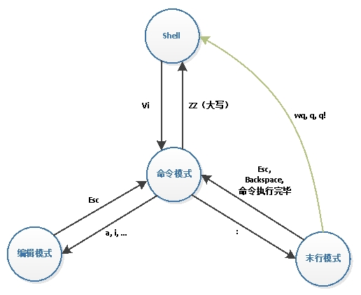

# Linux_cpp_firsttry

[TOC]

https://subingwen.cn/linux/

## 第一章 Linux基础

### 一、初识Linux操作系统

https://subingwen.cn/linux/version-path/

#### 1. Linux介绍

**1.1 Linux诞生**

**Linux** 是 **UNIX 操作系统**的一个**克隆系统**, 但是Linux是**开源的**

Linux 和 GNU 一拍即合，就有了我们现在使用的操作系统，GNU 奠定了 Linux 用户基础和开发环境

**Linux主要特性：**

* Linux 是一个**基于文件**的操作系统

操作系统需要和硬件进行交互，对应 Linux 来说这些硬件都是文件，比如：操作系统会将 硬盘 , 鼠标 , 键盘 , 显示屏等抽象成一个设备文件来进行管理。

* 可以**同时登陆多个**用户，并且每个用户可以同时运行多个应用程序。
* 支持**多平台**（这里指的是基于不同 CPU 架构的平台）

**1.2 名词**

**GNU**：Gnu’s Not Unix

**GPL**：General Public License

**POSIX**：（Portable Operating System Interface for Computing Systems）

**1.3 Linux发行版**

**CentOS**：www.centos.org

CentOS 是一种对 RHEL（Red Hat Enterprise Linux）源代码再编译的产物，由于 Linux 是 开发源代码的操作系统，并不排斥基于源代 码的再分发，CentOS 就是将商业的 Linux 操 作系统 RHEL 进行源代码再编译后分发，并 在 RHEL 的基础上修正了不少已知的漏洞

**Ubuntu**：www.ubuntu.com

优秀易用的桌面环境，基于 Debian 构建。官方每年会发布两个版本，每个版本的版本号由两部分组成: 主版本号 + 副版本号，主版本号为当年年份，长期支持版的年份为偶数，测试版年份为奇数，副版本号为月份，在 4 月份发布的为相对稳定版， 在 10 月份发布的为测试版。

1.4 Linux内核**

Linux 系统从应用角度来看，分为内核空间和用户空间两个部分。

Linux 的内核主要由 5 个子系统组成：进程调度、内存管理、虚拟文件系统、网络接口、进程间通信。下面将依次讲解这 5 个子系统。

* **进程调度SCHED**：进程调度指的是系统对进程的多种状态之间转换的策略。Linux 下的进程调度有 3 种策略：SCHED_OTHER、SCHED_FIFO 和 SCHED_RR。

  * SCHED_OTHER：分时调度策略（默认），是用于针对普通进程的时间片轮转调度策略。
  * SCHED_FIFO：实时调度策略，是针对运行的实时性要求比较高、运行时间短的进程调度策略
  * SCHED_RR：实时调度策略，是针对实时性要求比较高、运行时间比较长的进程调度策略。

* **内存管理MMU**

  * 内存管理是多个进程间的内存共享策略。在 Linux 中，内存管理主要说的是虚拟内存。
  * 虚拟内存可以让进程拥有比实际物理内存更大的内存，可以是实际内存的很多倍。
  * 每个进程的虚拟内存有不同的地址空间，多个进程的虚拟内存不会冲突。

* **虚拟文件系统VFS**

  * 在 Linux 下支持多种文件系统，如 ext、ext2、minix、umsdos、msdos、vfat、ntfs、proc、smb、ncp、iso9660、sysv、hpfs、affs 等。
  * 目前 Linux 下最常用的文件格式是 ext2 和 ext3。

* **网络接口**：Linux 是在 Internet 飞速发展的时期成长起来的，所以 Linux 支持多种网络接口和协议。网络接口分为网络协议和驱动程序，网络协议是一种网络传输的通信标准，而网络驱动则是对硬件设备的驱动程序。Linux 支持的网络设备多种多样，几乎目前所有网络设备都有驱动程序。

* **进程间通信**：Linux 操作系统支持多进程，进程之间需要进行数据的交流才能完成控制、协同工作等功能，Linux 的进程间通信是从 UNIX 系统继承过来的。Linux 下的进程间的通信方式主要有**管道、信号、消息队列、共享内存和套接字**等方法。


#### 2. Linux目录

与 Windows 下的文件组织结构不同，Linux 不使用磁盘分区符号来访问文件系统，而是将**整个文件系统表示成树状的结构**，Linux 系统每增加一个文件系统都会将其加入到这个树中。

操作系统文件结构的开始，只有一个单独的顶级目录结构，叫做根目录。所有一切都**从“根”开始，用“/”代表**，并且延伸到子目录。Linux 则通过 **“挂接” 的方式把所有分区都放置在 “根” 下各个目录里**。一个 Linux 系统的文件结构如下图所示。

**2.1 Linux目录结构**


在 linux 中根目录的子目录结构相对是固定的 (名字固定), 不同的目录功能是也是固定的

* bin: binary, 二进制文件目录，存储了可执行程序，今天要将的命令对应的可执行程序都在这个目录中

* sbin: super binary, root 用户使用的一些二进制可执行程序

* etc: 配置文件目录，系统的或者用户自己安装的应用程序的配置文件都存储在这个目录中

* lib: library, 存储了一些动态库和静态库，给系统或者安装的软件使用

* media: 挂载目录，挂载外部设备，比如：光驱，扫描仪

* mnt: 临时挂载目录，比如我们可以将 U 盘临时挂载到这个目录下

* proc: 内存使用的一个映射目录，给操作系统使用的

* tmp: 临时目录，存放临时数据，重启电脑数据就被自动删除了

* boot: 存储了开机相关的设置

* home: 存储了普通用户的家目录，家目录名和用户名相同

* root: root 用户的家目录

* dev: device , 设备目录，Linux 中一切皆文件，所有的硬件会抽象成文件存储起来，比如：键盘， 鼠标

* lost+found: 一般时候是空的，电脑异常关闭 / 崩溃时用来存储这些无家可归的文件，用于用户系统恢复

* opt: 第三方软件的安装目录

* var: 存储了系统使用的一些经常会发生变化的文件， 比如：日志文件

* usr: unix system resource, 系统的资源目录
  * /usr/bin: 可执行的二进制应用程序
  * /usr/games: 游戏目录
  * /usr/include: 包含的标准头文件目录
  * /usr/local: 和 opt 目录作用相同，安装第三方软件

对于用户自己的文件，一般都是存放到自己的家目录中，也就是 `/home/用户名`里边，通过指定的相应的路径就可以找到这个文件了。关于路径的指定的有两种方式：相对路径和绝对路径。

**2.2 相对路径**

相对路径就是相对于当前文件的路径

* `./`：也可用.表示
* `../`:当前目录的上一层，也可用..表示

**2.3 绝对路径**

* Linux：起始节点为根目录，比如： /root/luffy/get/onepiece
* Windows: 起始节点为某个磁盘的盘符，比如：f:\\\root\\\luffy\\\get\\\onepiece


#### 3.命令解析器

在 Linux 中需要通过终端执行对应的命令来完成某些操作，这些命令都是通过命令解析器解析完成并执行的

**3.1 工作原理**

命令解析器在Linux操作系统中就是一个进程，它的名字叫做`bash`，也就是`shell`（UNIX是shell，bash是Linux中的增强版sh）。

* 在Linux中有一个叫做`PATH`的环境变量，里面存储了一些系统目录

```
#通过echo命令可以查看环境变量PATH中的值
echo $PATH
```

* 命令解析器需要依次搜索`PATH`中的各个目录，检查这些目录中是否有用户输入的指令
  * 如果找到了，执行该目录下的可执行程序，用户输入的命令就被执行完毕了
  * 如果没有找到，继续搜索其他目录，最后还是没有找到，会提示命令找不到，因此无法被执行

**3.2 命令提示行**

在 Linux 终端中，输入要执行的指令之前会有想用的命令提示，我们将其称之为命令提示行

```
[root@VM-8-14-centos ~/luffy/get/onepiece]#
[robin@VM-8-14-centos ~/luffy/get/onepiece]$ 
```

* root : 当前登录的用户的用户名

* @: at -> 在
* VM-8-14-centos: 主机名，在安装这个 linux 操作系统的时候手动指定，可以修改
  * ~: 当前用户的家目录
    * 在 linux 中有很多用户，每个用户都用一个属于自己的目录，这个目录称之为家目录
    * 普通用户家目录 /home/用户名 , root 用户家目录 /root
  * ~/luffy/get/onepiece: 当前用户所在的工作目录，也可以使用 `pwd` 命令查看
  * #: 代表当前用户是 root 用户
  * $: 当前用户是普通用户，也就是说例子中的 robin 是一个普通用户

**3.3 命令行快捷键**

| 快捷键           | 功能                      | 备注                                                         |
| ---------------- | ------------------------- | ------------------------------------------------------------ |
| **Tab**          | 命令自动补齐              | 我们可以连续按两次Tab键，在当前终端中就可以显示出所有匹配成功的shell命令 |
| Ctrl+p           | 显示输入的上一个历史命令  | **↑**                                                        |
| Ctrl+n           | 显示输入的下一个历史命令  | **↓**                                                        |
| Ctrl+a           | 光标移动命命令行首        | **Home**                                                     |
| Ctrl+e           | 光标移动命命令行尾        | **End **                                                     |
| Ctrl+u           | 删除光标前的部分字符串    |                                                              |
| Ctrl+k           | 删除光标后的部分字符串    |                                                              |
| →                | 光标向右移动一个字符      |                                                              |
| ←                | 光标向右移动一个字符      |                                                              |
| Backspace/Delete | 删除光标前 / 后的一个字符 |                                                              |

### 二、常用命名

### 1.文件管理命令

https://subingwen.cn/linux/file-commands/#8-1-%E4%BF%AE%E6%94%B9%E6%96%87%E4%BB%B6%E6%96%87%E4%BB%B6%E6%9D%83%E9%99%90

##### **cd命令**

* 进入指定目录
* 进入家目录 1. cd 2. cd `~`
  * 普通用户：/home/用户名
  * 管理员：/root
* 在临近的两个目录之间切换  cd -

##### **ls命令**

```
ls [args] 目录名/文件名
```

* 显示所有文件 `ls -a`
* 显示文件详细信息 `ls -l`

边的信息量还是非常大的，其中包括: **文件类型 , 文件所有者对文件的操作权限 , 文件所属组用户对文件的操作权限 , 其他人对文件的操作权限 , 硬链接计数 , 文件所有者 , 文件所属组 , 文件大小 , 文件的修改日期 , 文件名**

```
robin@OS:~$ ls -l
total 204
-rw-rw-r--  1 robin robin    268 Mar 22 17:32 a.c
drwxrwxr-x  2 robin robin   4096 Aug  4  2019 config
-rw-r--r--  1 robin robin 129487 Dec 25 11:28 english.txt
drwxrwxr-x  5 robin robin   4096 Jan 13 17:35 udp

# 文件详细信息介绍
 d      rwx       rwx     r-x     5    robin    robin    4096    Jan 13 17:35    udp
 |       |         |       |      |      |        |       |          |	          |
文件    文件所    文件所   其他人 硬链接  文件     文件   文件大小  文件修改时间     文件名
类型   有者权限  属组权限  权限   计数   所有者   所属组  
```

#

**文件类型**

在 Linux 操作系统中，一共有 7 中文件类型，这 7 中类型是根据文件属性进行划分的，而不是根据文件后缀划分的。

-: 普通的文件，在 Linux 终端中没有执行权限的为白色，压缩包为红色，可执行程序为绿色字体
d: 目录 (directory), 在 Linux 终端中为蓝色字体，如果目录的所有权限都是开放的，有绿色的背景色
l: 软链接文件 (link), 相当于 windows 中的快捷方式，在 Linux 终端中为淡蓝色 (青色) 字体
c: 字符设备 (char), 在 Linux 终端中为黄色字体
b: 块设备 (block), 在 Linux 终端中为黄色字体
p: 管道文件 (pipe), 在 Linux 终端中为棕黄色字体
s: 本地套接字文件 (socket), 在 Linux 终端中为粉色字体

**用户类型**

在 Linux 中有三大类用户: **文件所有者 , 文件所属组用户 , 其他人** , 我们可以对同一个文件给这三种人设置不同的操作权限，用于限制用户对文件的访问。

* 文件所有者：文件的主人
* 文件所属组：文件的主人属于哪个组，文件默认也就属于哪个组
* 其他人

**文件权限**

* 读权限 ,r 
* 写权限 , w
* 执行权限 ,x 
* 无权限,-

**硬链接计数**

硬链接计数是一个整数，如果这个数为 N (N>=1)，就说明在一个或者多个目录下一共有 N 个文件，但是这 N 个文件并不占用多块磁盘空间，他们使用的是同一块，如果通过其中一个文件修改了磁盘数据，那么其他文件中的内容也就变了。每当我们给给磁盘文件创建一个硬链接（使用 ln），磁盘上就会出现一个新的文件名，硬链接计数加 1，但是这新文件并不占用任何的磁盘空间，文件名还是映射到原来的磁盘地址上。。

硬链接和拷贝区别：


**其他属性**

* 文件大小->单位是字节
* 文件日期：修改日期
* 文件名：如果文件类型是软连接会这样显示： link -> /root/file/test, 后边的路径表示快捷方式链接的是哪个磁盘文件

除了ls -l外还有其他参数

`ls -lh`说人话，显示基于字节进行换算

`ls -lF`如果是目录，后面会加多一个/

#### 创建删除目录

##### **mkdir命令**

创建目录：1.单层目录：`mkdir 新目录名字`	2.多层目录：`mkdir parent/child/baby1 -p`

##### **rmdir/rm命令**

* rmdir: 只能删除空目录
* rm: 可删除文件，删除目录需要加-r，意思是递归（recursion）
  * -i：删除时给提示
  * -f：强制删除文件，直接删除且不能回复

##### **cp命令**

cp 就是 copy, 拷贝，使用这个命令可以拷贝文件也可以拷贝目录

* 拷贝文件 => 文件不存在得到新文件, 文件存在就覆盖。语法：cp 文件A 文件B，拷贝文件A到文件B
* 拷贝目录 ==> 目录不存在得到新目录, 该目录被拷贝到存在的目录中，拷贝目录需要-r。语法：cp 目录A 目录B -r

```
cp A/a.txt B	# 拷贝 A目录中的 a.txt 到目录B中
cp A/* B -r	# 拷贝 A目录中的所有文件到目录B中, 不能确定A目录中是否有子目录, 因此需要加 -r
```

##### **mv命令**

mv 就是 move, 这个 Linux 命令既能移动文件所在目录也可以给文件改名。

* 文件的移动。 mv A B, 其中A可以是文件也可以是目录, B必须是目录而且必须是存在的
* 文件改名。 mv A B，其中A可以是文件也可以是目录，并且是存在的, B原来是不存在的
* 文件覆盖。 mv A B， A文件中的内容覆盖B文件中的内容, A文件被删除, 只剩下B文件

#### 查看文件内容

##### **cat命令**

该命令可以将文件内容显示到终端，由于终端是有缓存的，因此能显示的字节数也是受限制的。 如果文件太大数据就不能完全显示出来了，因此该命令适合查看比较小的文件内容。

##### **more命令**

cat 要高级一点，我们可以以翻屏的方式查看文件中的内容。回车: 显示下一行，空格: 向下滚动一屏，b: 返回上一屏，q: 退出more

##### **less命令**

跟more差不多

##### **head命令**

文件头部若干行，head -行数 文件名

##### **tail命令**

#### 链接的创建

原理上，硬链接和源文件的inode节点号相同，两者互为硬链接。软连接和源文件的inode节点号不同，进而指向的block也不同，软连接block中存放了源文件的路径名。 实际上，**硬链接和源文件是同一份文件**，而**软连接是独立的文件，类似于快捷方式，存储着源文件的位置信息便于指向**。 使用限制上，不能对目录创建硬链接，不能对不同文件系统创建硬链接，不能对不存在的文件创建硬链接；可以对目录创建软连接，可以跨文件系统创建软连接，可以对不存在的文件创建软连接。

##### **ln命令**

* 软连接：绝对路径

```
# 语法: ln -s 源文件路径 软链接文件的名字(可以带路径)

# 查看目录文件
[root@VM-8-14-centos ~/luffy]# ll
total 8
drwxr-xr-x 3 root root 4096 Jan 25 17:27 get
-rw-r--r-- 1 root root   37 Jan 25 17:26 onepiece.txt

# 给 onepiece.txt 创建软连接, 放到子目录 get 中
[root@VM-8-14-centos ~/luffy]# ln -s /root/luffy/onepiece.txt get/link.lnk  
[root@VM-8-14-centos ~/luffy]# ll get
total 4
lrwxrwxrwx 1 root root   24 Jan 25 17:27 link.lnk -> /root/luffy/onepiece.txt
drwxr-xr-x 2 root root 4096 Jan 24 21:37 onepiece
```

* 硬链接：相对路径; 目录是不允许创建硬链接的。

```
# 语法: ln 源文件 硬链接文件的名字(可以带路径)

# 创建硬链接文件, 放到子目录中
[root@VM-8-14-centos ~/luffy]# ln onepiece.txt get/link.txt

# 查看链接文件和硬链接计数, 从 1 --> 2
[root@VM-8-14-centos ~/luffy]# ll get
total 8
lrwxrwxrwx 1 root root   24 Jan 25 17:27 link.lnk -> /root/luffy/onepiece.txt
-rw-r--r-- 2 root root   37 Jan 25 17:26 link.txt
drwxr-xr-x 2 root root 4096 Jan 24 21:37 onepiece
```

#### 文件属性

**修改文件文件权限**

##### **chmod命令**

文件权限是针对**文件所有者 , 文件所属组用户 , 其他人**这三类人而言的，对应的操作指令是 chmod。设置方式也有两种，分别为**文字设定法**和数字设定法。

* 文字设定法

```
#chmod
# 语法格式: chmod who [+|-|=] mod 文件名
	- who:
		- u: user  -> 文件所有者
		- g: group -> 文件所属组用户
		- o: other -> 其他
		- a: all, 以上是三类人 u+g+o
	- 对权限的操作:
		+: 添加权限
		-: 去除权限
		=: 权限的覆盖
	- mod: 权限
		r: read, 读
		w: write, 写
		x: execute, 执行
		-: 没有权限

# 将文件所有者权限设置为读和执行, 也就是权限覆盖
chmod u=rx b.txt 
# 给其他人添加写和执行权限
robin@OS:~/Linux$ chmod o+wx b.txt 
# 给文件所属组用户去掉读和执行权限
robin@OS:~/Linux$ chmod g-rx b.txt 
# 将文件所有者,文件所属组用户,其他人权限设置为读+写+执行
robin@OS:~/Linux$ chmod a=rwx b.txt
```

* 数字设定法

```
# 语法格式: chmod [+|-|=] mod 文件名
	- 对权限的操作:
		+: 添加权限
		-: 去除权限
		=: 权限的覆盖, 等号可以不写
	- mod: 权限描述, 所有权限都放开是 7
		- 4: read, r
		- 2: write, w
		- 1: execute , x
		- 0: 没有权限

# 分解: chmod 0567 a.txt

    0           5           6             7
  八进制     文件所有者  文件所属组用户    其他人
              r + x       r + w         r+w+x


# 文件所有者去掉执行权限, 所属组用户去掉写权限, 其他人去掉读+写权限
robin@OS:~/Linux$ chmod -123 c.txt
# 文件所有者添加执行权限, 所属组用户和其他人权限不变
robin@OS:~/Linux$ chmod +100 c.txt
# 将文件所有者,文件所属组用户,其他人权限设置为读+写, 没有执行权限
robin@OS:~/Linux$ chmod 666 c.txt
```

**修改文件所有者**

##### **chown命令**

默认情况下，文件是通过哪个用户创建出来的，就属于哪个用户，这个用户属于哪个组，文件就属于哪个组。如果有特殊需求，可以修改文件所有者，对应的操作命令是 chown。因为修改文件所有者就跨用户操作，普通用户没有这个权限，需要借助管理员权限才能完成该操作。

普通用户借助管理员权限执行某些shell命令, 需要在命令前加关键字sudo, 但是普通用户默认是没有使用 sudo的资格的, 需要修改 `/etc/sudoers` 文件

https://subingwen.cn/linux/sudoers/

```
# 语法1-只修改所有者: 
$ sudo chown 新的所有者 文件名

# 语法2-同时修改所有者和所属组: 
$ sudo chown 新的所有者:新的组名 文件名

# 将 b.txt 的所有者修改为 luffy
robin@OS:~/Linux$ sudo chown luffy b.txt
[sudo] password for robin: 
robin@OS:~/Linux$ ll b.txt 
-rw-rw-rw- 2 luffy robin 2929 Apr 14 18:53 b.txt

# 同时修改文件所有者和文件所属组
robin@OS:~/Linux$ sudo chown robin:luffy b.txt 
robin@OS:~/Linux$ ll b.txt 
-rw-rw-rw- 2 robin luffy 2929 Apr 14 18:53 b.txt
```

**修改文件所属组**

##### **chgrp命令**

`sudo chgrp 新的组 文件名`

#### 其他命令

##### **tree命令**

```
# 语法格式
$ tree [-L n]         # 查看当前目录的结构, n为显示的目录层数
$ tree 目录名  [-L n]	# 查看指定目录的结构, n为显示的目录层数

# tree -L 1
```

##### **pwd命令**

pwd 命令用户当前所在的工作目录，没有参数，直接执行该命令即可。

##### **touch命令**

使用 touch 命令可以创建一个新的空文件 , 如果指定的文件是已存在的，只会更新文件的修改日期，对内容没有任何影响。

`touch 文件名`

##### **which命令**

which 命令可以查看要执行的命令所在的实际路径，命令解析器工作的时候也会搜索这个目录。需要注意的是该命令只能查看非内建的shell指令所在的实际路径, 有些命令是直接写到内核中的, 无法查看。

我们使用的大部分 shell 命令都是放在系统的 **/bin 或者 /usr/bin** 目录下:

##### **重定向命令**

关于重定向使用最多的是就是输出重定向 , 顾名思义就是修改输出的数据的位置，通过重定向操作我们可以非常方便的进行文件的复制，或者文件内容的追加。输出重定向使用的不是某个关键字而是符号 **> 或者 >>**。

* \>: 将文件内容写入到指定文件中，如果文件中已有数据，则会使用新数据覆盖原数据
* \>>:将输出的内容追加到指定的文件尾部

`date >> test.txt`

### 2.用户管理命令

#### 切换用户

Linux 是一个多用户的操作系统，可以同时登陆多个用户，因此很多时候需要在多个用户之间切换，用户切换需要使用 su 或者 su -。使用 `su` 只切换用户，当前的工作目录不会变化，但是使用 `su -` 不仅会切换用户也会切换工作目录，工作目录切换为当前用户的家目录。

从用户 A 切换到用户 B， 如果还想再切换回用户 A，可以直接使用 `exit`。

```
# 只切换用户, 工作目录不变
$ su 用户名
# 举例:
robin@OS:~/Linux$ su luffy

# 切换用户和工作目录, 会自动跳转到当前用户的家目录中
$ su - 用户名
# 举例:
robin@OS:~/Linux$ su - luffy
/home/luffy		# 工作目录变成了luffy的家目录

# 回到原来的用户
$ exit
```

#### 添加删除用户

**添加**

`sudo useradd`

```
# 添加用户
# sudo -> 使用管理员权限执行这个命令
$ sudo adduser 用户名

# centos
$ sudo useradd 用户名

# ubuntu
$ sudo useradd -m -s /bin/bash  用户名
```

首先在 /home 目录中会出现一个和用户名同名的目录,另外我们还可以查看 /etc/passwd 文件，里边记录着新添加的用户的更加详细的信息

**删除**

删除用户并不是将 `/home` 下的用户家目录删除就完事儿了，我们需要使用 `userdle` 命令才能删除用户在系统中的用户 ID 和所属组 ID 等相关信息，但是需要注意的是在**某些Linux版本中用户虽然被删除了， 但是它的家目录却没有被删除，需要我们手动将其删除**。

```
# 删除用户, 添加参数 -r 就可以一并删除用户的家目录了
$ sudo userdel 用户名 -r

# 删除用户 lisi
$ sudo userdel lisi -r

# 使用deluser不能添加参数-r, 家目录不能被删除, 需要使用 rm 命令删除用户的家目录, 比如:
$ sudo rm /home/用户名 -r
```

CentOS 版本只支持 userdel命令 , 在 Ubuntu中既支持 userdel 也支持 deluser命令。

**添加删除用户组**

```
# 基于普通用户创建新的用户组
$ sudo groupadd 组名

# 基于普通用户删除已经存在的用户组
$ sudo groupdel 组名
```

#### 修改密码

Linux 中设置用户密码和修改用户密码的方式是一样的，修改用户密码又分几种情况: **修改当前用户密码 , 普通用户A修改其他普通用户密码 , 普通用户A修改root用户密码 , root用户修改普通用户密码**。修改密码需要使用 `passwd` 命令。当创建了一个普通用户却没有提示指定密码，或者忘记了用户密码都可以通过该命令来实现自己重置密码的需求。

```
# passwd
# 修改当前用户
$ passwd

# 修改非当前用户密码
$ sudo passwd 用户名

# 修改root
$ sudo passwd root
```

### 3.压缩命令

#### **tar命令**

在 Linux 操作系统中默认自带两个原始的压缩工具分别是 `gzip` 和 `bzip2`, 但是它们都有先天的缺陷，不能打包压缩文件, 每个文件都会生成一个单独的压缩包, 并且压缩之后不会保留原文件

Linux 中自带一个打包工具，叫做 `tar`, 默认情况下该工具是不能进行压缩操作的

在使用 tar 进行压缩和解压缩的时候，只需要指定相对用的参数，在其内部就会调用对应的压缩工具 gzip 或者 bzip2 完成指定的操作。

**压缩**

参数：c：创建压缩文件	z：使用gzip	j：使用bzip2	v：显示压缩信息	f：指定压缩包的名字

`tar 参数 生成的压缩包的名字 要压缩的文件(文件或者目录)`

`.tgz` 文件就等同于 `.tar.gz` 文件；压缩使用 `bzip2` 方式, 标准后缀格式为: `.tar.bz2`

```
#使用gzip
# 查看目录内容
[root@VM-8-14-centos ~/luffy]# ls
get  onepiece.txt  robin.txt

# 压缩目录中所有文件, 如果要压缩某几个文件, 直接指定文件名即可
[root@VM-8-14-centos ~/luffy]# tar zcvf all.tar.gz *
get/                     # ....... 压缩信息
get/link.lnk             # ....... 压缩信息
get/onepiece/            # ....... 压缩信息
get/onepiece/haha.txt
get/link.txt
onepiece.txt
robin.txt

#使用 bzip2
# 查看目录内容
[root@VM-8-14-centos ~/luffy]# ls
all.tar.gz  get  onepiece.txt  robin.txt

# 压缩目录中除 all.tar.gz 的文件和目录
[root@VM-8-14-centos ~/luffy]# tar jcvf part.tar.bz2 get onepiece.txt robin.txt 
get/                   # ....... 压缩信息
get/link.lnk           # ....... 压缩信息
get/onepiece/          # ....... 压缩信息
get/onepiece/haha.txt
get/link.txt
onepiece.txt
robin.txt
```

**解压缩**

参数：x：解压缩文件	z：使用gzip	j：使用bzip2	v：显示解压缩信息	f：指定压缩包的名字

`tar 参数 压缩包名 -C 解压目录`

```
#使用gzip
# 查看目录文件信息
[root@VM-8-14-centos ~/luffy]# ls
all.tar.gz  get  onepiece.txt  part.tar.bz2  robin.txt  temp

# 将 all.tar.gz 压缩包解压缩到 temp 目录中
[root@VM-8-14-centos ~/luffy]# tar zxvf all.tar.gz -C temp
get/                      # 解压缩文件信息
get/link.lnk              # 解压缩文件信息
get/onepiece/             # 解压缩文件信息
get/onepiece/haha.txt     # 解压缩文件信息
get/link.txt
onepiece.txt
robin.txt。
```

#### **zip命令**

安装之后才能使用

**压缩**

```
# 语法: 后自动添加压缩包后缀 .zip, 如果要压缩目录, 需要添加参数 r
$ zip [-r]  压缩包名 要压缩的文件

# 查看目录文件信息
[root@VM-8-14-centos ~/luffy]# ls
get  onepiece.txt  robin.txt  temp

# 压缩目录 get 和文件 onepiece.txt robin.txt 得到压缩包 all.zip(不需要指定后缀, 自动添加)
[root@VM-8-14-centos ~/luffy]# zip all onepiece.txt robin.txt get/ -r
  adding: onepiece.txt (stored 0%)
  adding: robin.txt (stored 0%)
  adding: get/ (stored 0%)
  adding: get/link.lnk (stored 0%)             # 子目录中的文件也被压缩进去了
  adding: get/onepiece/ (stored 0%)            # 子目录中的文件也被压缩进去了
  adding: get/onepiece/haha.txt (stored 0%)    # 子目录中的文件也被压缩进去了
  adding: get/link.txt (stored 0%)             # 子目录中的文件也被压缩进去了
```

**解压缩**

```
# 语法: 解压到指定目录, 需要添加参数 -d
$ unzip 压缩包名 -d 解压目录
```

#### **rar命令**

`rar` 这种压缩格式在 Linux 中并不常用，这是 Windows 常用的压缩格式

**压缩**

使用 rar 压缩过程中的注意事项和 zip 是一样的，如果压缩的是目录, 需要指定参 `-r,` 如果只压缩文件就不需要添加了。压缩过程中需要使用参数 `a` (archive), 压缩归档的意思。

`rar` 工具在生成压缩包的时候也会自动添加后缀，名字为.rar, 因此我们只需要指定压缩包的名字。

```
# 文件压缩, 需要使用参数 a, 压缩包名会自动添加后缀 .rar
# 如果压缩了目录, 需要加参数 -r
# 语法: 
$ rar a 压缩包名 要压缩的文件 [-r]

# 举例
# 查看目录文件信息
[root@VM-8-14-centos ~/luffy]# ls
get  onepiece.txt  robin.txt  temp

# 压缩文件 onepiece.txt, robin.txt 和目录 get/ 到要是文件 all.rar 中
[root@VM-8-14-centos ~/luffy]# rar a all onepiece.txt get/ robin.txt -r 

RAR 6.00   Copyright (c) 1993-2020 Alexander Roshal   1 Dec 2020
Trial version             Type 'rar -?' for help

Evaluation copy. Please register.

Creating archive all.rar

Adding    onepiece.txt                     OK 
Adding    get/link.lnk                     OK        # 子目录中的文件也被压缩了 
Adding    get/onepiece/haha.txt            OK        # 子目录中的文件也被压缩了
Adding    get/link.txt                     OK        # 子目录中的文件也被压缩了  
Adding    robin.txt                        OK 
Adding    get/onepiece                     OK      
```

**解压缩**

```
unrar x 压缩包名字 解压目录
# 查看目录文件信息
[root@VM-8-14-centos ~/luffy]# ls
all.rar  get  onepiece.txt  robin.txt  temp

# 删除 temp 目录中的所有文件
[root@VM-8-14-centos ~/luffy]# rm temp/* -rf

# 将 all.rar 中的文件解压缩到 temp 目录中
[root@VM-8-14-centos ~/luffy]# rar x all.rar temp/ 
```

#### **xz**

`.xz` 格式的文件压缩和解压缩都相对比较麻烦，通过一个命令是完不成对应的操作的，需要通过两步操作才行。并且操作过程中需要使用 tar 工具进行打包，压缩使用的则是 `xz` 工具。

**压缩**

创建文件的步骤如下，首先 将需要压缩的文件打包 tar cvf xxx.tar files, 然后再对打包文件进行压缩 xz -z xxx.tar, 这样我们就可以得到一个打包之后的压缩文件了。

使用 xz 工具压缩文件的时候需要添加参数 -z

```
# 语法:
# 第一步
$ tar cvf xxx.tar 要压缩的文件
# 第二步, 最终得到一个xxx.tar.xz 格式的压缩文件
$ xz -z xxx.tar


# 查看目录文件信息
[root@VM-8-14-centos ~/luffy]# ls
get  onepiece.txt  robin.txt  temp

# 将文件 onepiece.txt, robin.txt 和目录 get 打包到 all.tar 中
[root@VM-8-14-centos ~/luffy]# tar cvf all.tar onepiece.txt robin.txt get/
onepiece.txt
robin.txt
get/
get/link.lnk
get/onepiece/
get/onepiece/haha.txt
get/link.txt

# 查看目录文件信息, 多了一个打包文件 all.tar
[root@VM-8-14-centos ~/luffy]# ls
all.tar  get  onepiece.txt  robin.txt  temp

# 使用 xz 工具压缩打包文件 all.tar
[root@VM-8-14-centos ~/luffy]# xz -z all.tar 
```

**解压缩**

解压缩的步骤和压缩的步骤相反，需要先解压缩，然后将文件包中的文件释放出来。

使用 xz 工具解压需要使用参数 -d。

```
# 语法:
# 第一步： 压缩包解压缩, 得到 xxx.tar
$ xz -d xxx.tar.xz
# 第二步: 将 xxx.tar 中的文件释放到当前目录
$ tar xvf xxx.tar 	

# 查看目录中文件信息, 有一个 all.tar.xz
[root@VM-8-14-centos ~/luffy]# ls
all.tar.xz  get  onepiece.txt  robin.txt  temp

# 将 all.tar.xz 解压缩, 得到 all.tar
[root@VM-8-14-centos ~/luffy]# xz -d all.tar.xz 

# 查看目录文件, 得到了 all.tar
[root@VM-8-14-centos ~/luffy]# ls
all.tar  get  onepiece.txt  robin.txt  temp

# 释放 all.tar 到当前目录
[root@VM-8-14-centos ~/luffy]# tar xvf all.tar 
onepiece.txt
robin.txt
get/
get/link.lnk
get/onepiece/
get/onepiece/haha.txt
get/link.txt
```

### 4.查找命令

 Linux 为我们提供了很多的用于文件搜索的命令，如果需求比较简单可以使用 **locate，which，whereis** 来完成搜索，如果需求复杂可以使用 **find, grep** 进行搜索。

#### **find命令**

find 是 Linux 中一个搜索功能非常强大的工具，它的主要功能是根据文件的属性，查找对应的磁盘文件，比如说我们常用的一些属性 **文件名 , 文件类型 , 文件大小 , 文件的目录深度**

**文件名 -name**

**精确查询**和**模糊查询**。关于模糊查询必须要使用对应的**通配符**，最常用的有两个， 分别为 * 和 ?。其中 * 可以匹配**零个或者多个**字符, ?用于匹配**单个**字符。

如果我们进行模糊查询，建议（非必须）将**带有通配符的文件名写到引号**中（单引号或者双引号都可以），这样可以避免搜索命令执行失败（如果不加引号，某些情况下会这样）。

```
# find 搜索的路径 -name 要搜索的文件名
# 模糊搜索
# 搜索 root 家目录下文件后缀为 txt 的文件
[root@VM-8-14-centos ~]# find /root -name "*.txt"
/root/luffy/get/onepiece/haha.txt
/root/luffy/get/onepiece/onepiece.txt
/root/luffy/get/onepiece.txt
/root/luffy/get/link.txt
/root/luffy/robin.txt
/root/luffy/onepiece.txt
/root/ace/brother/finally/die.txt
/root/onepiece.txt

##################################################

# 精确搜索
# 搜索 root 家目录下文件名为 onepiece.txt 的文件
[root@VM-8-14-centos ~]# find /root -name "onepiece.txt"
/root/luffy/get/onepiece/onepiece.txt
/root/luffy/get/onepiece.txt
/root/luffy/onepiece.txt
/root/onepiece.txt
```

**文件类型 -type**

文件类型	类型的字符描述
普通文件类型	f
目录类型	d
软连接类型	l
字符设备类型	c
块设备类型	b
管道类型	p
本地套接字类型	s

```
# 语法格式: 
$ find 搜索的路径 -type 文件类型
```

**文件大小 -size**

如果需要根据文件大小进行搜索，需要使用参数 `-size`。关于文件大小的单位有很多，可以根据实际需求选择，常用的分别有 `k(小写), M(大写), G(大写)`。

在进行文件大小判断的时候，需要指定相应的范围，涉及的符号有两个分别为：`加号 (+) 和 减号 (-)`，下面具体说明其使用方法：

```
# 语法格式: 
$ find 搜索的路径 -size [+|-]文件大小
	- 文件大小需要加单位: 
		- k (小写)
		- M (大写)
		- G (大写)

-size 4k 表示的区间为 (4-1k，4k], 表示一个区间，大于 3k, 小于等于 4k
-size -4k: [0k, 4-1k], 表示一个区间，大于等于 0 并且 小于等于 3k
-size +4k: (4k, 正无穷), 表示搜索大于 4k 的文件
```

**目录层级**

因为 Linux 的目录是树状结构，所有目录可能有很多层，在搜索某些属性的时候可以指定只搜索某几层目录，相关的参数有两个，分别为: `-maxdepth` 和 `-mindepth`

-maxdepth: 最多搜索到第多少层目录，
-mindepth: 至少从第多少层开始搜索

```
# 查找文件, 从根目录开始, 最多搜索5层, 这个文件叫做 *.txt (1 <= 层数 <= 5)
$ sudo find / -maxdepth 5 -name "*.txt"

# 查找文件, 从根目录开始, 至少从第5层开始搜索, 这个文件叫做 *.txt (层数>=5层)
$ sudo find / -mindepth 5 -name "*.txt"
```

**同时执行多个操作**

在搜索文件的时候如果想在一个 find 执行多个操作，通过使用管道 (|) 的方式是行不通的，比如下面的操作:

```
# 比如: 通过find搜索最多两层目录中后缀为 .txt 的文件, 然后再查看这些满足条件的文件的详细信息
# 在find操作中直接通过管道操作多个指令, 最终输出的结果是有问题, 因此不能直接这样使用
$ find ./ -maxdepth 2  -name "*.txt" | ls -l
total 612
drwxr-xr-x 2 root root   4096 Jan 26 18:11 a
-rw-r--r-- 1 root root    269 Jan 26 17:44 a.c
drwxr-xr-x 3 root root   4096 Jan 26 18:39 ace
drwxr-xr-x 4 root root   4096 Jan 25 15:21 file
lrwxrwxrwx 1 root root     24 Jan 25 17:27 link.lnk -> /root/luffy/onepiece.txt
drwxr-xr-x 4 root root   4096 Jan 26 18:39 luffy
-r--r--r-- 1 root root     37 Jan 26 16:50 onepiece.txt
-rw-r--r-- 1 root root 598314 Dec  2 02:07 rarlinux-x64-6.0.0.tar.gz
```

如果想要实现上面的需求，需要在 find 中使用 **exec, ok, xargs,** 这样就可以在 find 命令执行完毕之后，再执行其他的子命令了。

**exec**

`-exec` 是 find 的参数，可以在exec参数后添加其他需要被执行的shell命令。

find 添加了 exec 参数之后，命令的尾部需要加一个后缀 `{} \;`, 注意 {} 和 \ 之间需要有一个空格。

在参数 -exec 后添加的 shell 命令**处理的是 find 搜索之后的结果**，**find 的结果会作为 新添加的 shell 命令 的输入**，最后在终端上输出最终的处理结果。

```
# 语法：
$ find 路径 参数 参数值 -exec shell命令2 {} \;

# 搜索最多两层目录, 文件名后缀为 .txt的文件
$ find ./ -maxdepth 2  -name "*.txt" 
./luffy/robin.txt
./luffy/onepiece.txt
./onepiece.txt

# 搜索到满足条件的文件之后, 再继续查看文件的详细属性信息
$ find ./ -maxdepth 2  -name "*.txt" -exec ls -l {} \; 
-rw-r--r-- 1 root root 0 Jan 25 17:54 ./luffy/robin.txt
-r--r--r-- 2 root root 37 Jan 25 17:54 ./luffy/onepiece.txt
-r--r--r-- 1 root root 37 Jan 26 16:50 ./onepiece.txt
```

**ok**

-ok 和 -exec 都是 find 命令的参数，使用方式类似

```
# 语法: 其实就是将 -exec 替换为 -ok, 其他都不变
$ find 路径 参数 参数值 -ok shell命令2 {} \;
```

**xargs**

在使用 find 的 -exec 参数的时候，需要在指定的子命令尾部添加几个特殊字符 {} \;，一不小心就容易写错，有一种看起来更加直观、书写更加简便的方式，我们可以使用 xargs 替换掉 -exec 参数，而且在处理数据的时候 xargs更高效。有了 xargs 的加持我们就可以在 find 命令中直接使用管道完成前后命令的数据传递

```
# 在find 中 使用 xargs 关键字我们就可以使用管道了, 否则使用管道也不会起作用
# 将 find 搜索的结果通过管道传递给后边的shell命令继续处理
$ find 路径 参数 参数值 | xargs shell命令2
```

#### **grep**

参数： -r: 如果需要搜索目录中的文件内容，需要进行递归操作，必须指定该参数	-i:对应要搜索的关键字，忽略字符大小写的差别	-n:在显示符合样式的那一行之前，标示出该行的列数编号

```
# 语法格式: 
$ grep "搜索的内容" 搜索的路径/文件 参数

# 搜索指定文件中是否有字符串 include
[root@VM-8-14-centos ~]# grep "include" a.c
#include <stdio.h>
#include <unistd.h>
#include <fcntl.h>

# 不区分大小写进行搜索
[root@VM-8-14-centos ~]# grep "INCLUDE" a.c
[root@VM-8-14-centos ~]# grep "INCLUDE" a.c -i
#include <stdio.h>
#include <unistd.h>
#include <fcntl.h>

# 搜索指定目录中哪些文件中包含字符串 include 并且显示关键字所在的行号
[root@VM-8-14-centos ~]# grep "include" ./ -rn        
./a.c:1:#include <stdio.h>
./a.c:2:#include <unistd.h>
./a.c:3:#include <fcntl.h>
./luffy/get/e.c:1:#include <stdio.h>
./luffy/get/e.c:2:#include <unistd.h>
./luffy/get/e.c:3:#include <fcntl.h>
./luffy/c.c:1:#include <stdio.h>
./luffy/c.c:2:#include <unistd.h>
./luffy/c.c:3:#include <fcntl.h>
./ace/b.c:1:#include <stdio.h>
./ace/b.c:2:#include <unistd.h>
./ace/b.c:3:#include <fcntl.h>
./.bash_history:1449:grep "include" ./
./.bash_history:1451:grep "include" ./ -r
./.bash_history:1465:grep "include" a.c
```

#### **locate命令**

们可以将 `locate` 看作是一个简化版的 `find`, 使用这个命令我们可以根据文件名搜索本地的磁盘文件 , 但是 locate的效率比find要高很多。原因在于它不搜索具体目录，而是搜索一个本地的数据库文件，这个数据库中含有本地所有文件信息。Linux 系统自动创建这个数据库，并且每天自动更新一次，所以使用 locate 命令查不到最新变动过的文件。为了避免这种情况，可以在使用locate之前，先使用`updatedb`命令，手动更新数据库。

```
# 使用管理员权限更新本地数据库文件, root用户这样做
$ updatedb
# 非root用户需要加 sudo
$ sudo updatedb

1.搜索所有目录下以某个关键字开头的文件
$ locate test		# 搜索所有目录下以 test 开头的文件
2.搜索指定目录下以某个关键字开头的文件，指定的目录必须要使用绝对路径
$ locate /home/robin/test    # 指定搜索目录为 /home/robin/, 文件以 test 开头
3.搜索文件的时候，忽略文件名的大小写，使用参数 -i
$ locate TEST -i	# 文件名以小写的test为前缀的文件也能被搜索到
4.列出前 N 个匹配到的文件名称或路径名称，使用参数 -n
$ locate test -n 5		# 搜索基于正则表达式进行文件名匹配，查找符合条件的文件，使用参数 -r
5.文件前缀为 test 的文件, 并且只显示5条信息
# 使用该参数, 需要有正则表达式基础
$ locate -r "\.cpp$"		# 搜索以 .cpp 结尾的文件
```

## 三.常用工具

### vim的使用

如果我们拿到了一个纯净版的 Linux, 里边是没有 vim 的，但是有一个类似的文本编辑器叫做 Vi。vi 编辑器的功能不是很强，可以这样理解 vim 就是 vi 的增强版。

#### vim的模式

在 vim 中一共有三种模式，分别是 **命令模式 , 末行模式 , 编辑模式**，当我们打开 vim 之后默认进入的是命令模式。

* 命令模式：在该模式下我们可以进行**查看文件内容 , 修改文件 , 关键的搜索**等操作。

* 编辑模式：在该模式下主要对文件内容进行修改和内容添加。
* 末行模式：在该模式下可以进行 **执行Linux命令 , 保存文件 , 进行行的跳转 , 窗口分屏**等操作。




#### 命令模式下的操作

**打开：**文件不存在就创建

`vim 文件名`

**保存退出**

`ZZ`

**代码格式化**

`gg=G`

**光标移动**

```
在 vim 中可以使用键盘上的方向键 (↑, ↓, ←, →) 来移动光标，这种操作相对比较麻烦， 有一种更加简便的操作方式， 就是使用键盘上的 h, j, k, l
```

快捷键	功能	备注
0	光标移动到行首	无
$	光标移动到行尾部	选按两个键: shift + 4
gg	光标移动到文件头	第一行的开始
G	光标移动到文件尾部	最后一行的开始
nG	行跳转	n 代表要跳转到哪一行
n+回车	相对跳转 n 行	从光标所在当前行往下跳 n 行，n 对应的是一个整数

**删除命令**

在 vim 中是没有删除操作的，其实所谓的删除就是剪切，被删除的数据都可被粘贴到文档的任意位置，即便如此我们还是习惯性的将剪切操作称之为删除，常用的删除操作如下表所示:

x (小写)	删除光标后边的字符	vim 中的光标比较宽会盖住后边的字符
X (大写)	删除光标前边的字符	无
dw	删除单词	要先把光标移动到单词的第一个字母上再删除, 否则单词只能被删除一部分
d0	删除光标前的字符串	从字符串开头到光标当前位置的字符串被删除了
d$ (D)	删除光标后的字符串	从光标当前位置到字符串尾部的字符串被删除了，使用 D 也行
dd	删除光标所在行	无
ndd	删除 n 行	从光标所在行开始删除 n 行，n 对应的是一个整数处。

**撤销和反撤销**

u：撤销

ctrl+r：反撤销

**复制和粘贴**

快捷键	功能	备注
p	粘贴到光标所在行的下边	小写的 p
P	粘贴到光标所在行的上边	大写的 P
yy	复制光标所在行	无
nyy	从光标所在行向下复制 n 行	n是要复制的行数, 代表一个整数

#### 可视模式

v： 进入的字符可视化模式（Characterwise visual mode)，文本选择是以字符为单位的。
V ：进入的行可视化模式（Linewise visual mode)，文本选择是以行为单位的。
ctrl-v： 进入的块可视化模式（Blockwise visual mode），可以选择一个矩形内的文本。

快捷键	功能	备注
h	光标向左移动	移动光标用于可视模式下的数据块选择
j	光标向下移动	移动光标用于可视模式下的数据块选择
k	光标向上移动	移动光标用于可视模式下的数据块选择
l	光标向右移动	移动光标用于可视模式下的数据块选择
d	删除 (剪切)	删除可视模式下选中的数据块
y	复制	复制可视模式下选中的数据块
p (小写)	数据粘贴到光标的后边	粘贴在可视模式下复制或者剪切的数据块
P (大写)	数据粘贴到光标的前边	粘贴在可视模式下复制或者剪切的数据块

**代码注释**

1.过 ctrl+v 进入块可视模式

2.移动光标上移（k）或者下移（j），选中多个代码行的开头，如下图所示

3.选择完毕后，按大写的的 I 键，此时下方会提示进入 “insert” 模式，输入你要插入的注释符，例如: //

4.最后按 ESC 键，你就会发现选中的多行代码已经被注释了

删除多行注释的方法，同样 Ctrl+v 进入列选择模式，移动光标把要删除的注释符选中，按下 d，注释就被删除了。

**替换**

命令模式下的替换功能并不强，常用于某个单字符的替换。

r:单个字符

R：多个字符，Esc结束

**查找**

\	下一个:n 上一个N

?	上一个:n 下一个N

\# 光标需要放在被搜索的 

**查看 man 文档**

```
# 打开 man 文档首页
$ man man
# 退出 man 文档，直接按键盘上的 q 即可
q
```

#### 切换到编辑模式

快捷键	功能
i	从光标前边开始输入
a	从光标的后边开始输入
o	在光标下边创建新行，在新行中输入
s	删除光标后边的字符 (盖住的字符), 从删除的字符位置开始输入
I (大写的i)	从当前行行首开始输入
A	从当前行行尾开始输入
O	在光标上边创建新行，在新行中输入
S	删除当前行，在当前行开始输入

#### 末行模式下的操作

命令模式下按:

末行模式到命令模式 两次Esc

**保存退出**

末行模式下输入的命令	功能
q	退出，如果退出的时候文件没有保存，vim 会提示是否要保存
q!	直接退出，不保存 (强制退出)
w	保存，不退出 (相当在 windows 中于按了 ctrl+s)
wq	保存退出
x	保存退出

**替换：**

替换对应的命令是 s 并且可以给其指定参数，默认情况下只替换相关行的第一个满足条件的关键字， 如果需要整行替换需要加参数 `/g`。

末行模式下的替换命令	说明
s / 被替换的关键字 / 新的关键字 /g	只对光标所在行进行替换
行号 1, 行号 2s / 被替换的关键字 / 新的关键字 /g	[行号1 , 行号2] 是一个从小到大的范围，对这个范围进行替换
% s / 被替换的关键字 / 新的关键字 /g	% 代表对所有行进行替换

**分屏**

打开的时候就分屏：

vim -o水平

vim -O垂直

末行模式命令或者快捷键	说明	备注
sp	水平分屏，多个窗口垂直排列	多个窗口中显示同一个文件里的内容
vsp	垂直分屏，多个窗口水平排列	多个窗口中显示同一个文件里的内容
**ctrl+w+w	光标在打开的屏幕之间切换	快捷键操作**
(按住 ctrl 然后按两次 w)
qall	同时退出多个屏幕	
wqall	同时保存退出多个屏幕	
sp 文件名	分屏的同时指定打开的文件的名字	在新窗口中显示指定的文件的内容
vsp 文件名	分屏的同时指定打开的文件的名字	在新窗口中显示指定的文件的内容

**行跳转**

`:行号 回车`

**执行shell命令**

加感叹号

`:!ls`

会跳出去一下然后再回来

#### vim配置文件

vim 是一个文本编辑器工具，这个工具也是有配置文件的，文件的名字叫做 vimrc，在里边可以设置样式，功能 , 快捷键等属性 。对应的配置文件分为两种 **用户级别(~/.vimrc)**和**系统级别(/ect/vim/vimrc)**。

### GCC

https://subingwen.cn/linux/gcc/

GCC 是 Linux 下的编译工具集，是 GNU Compiler Collection 的缩写，包含 gcc、g++ 等编译器。这个工具集不仅包含编译器，还包含其他工具集，例如 ar、nm 等。

GCC 工具集不仅能编译 C/C++ 语言，其他例如 Objective-C、Pascal、Fortran、Java、Ada 等语言均能进行编译。GCC 在可以根据不同的硬件平台进行编译，即能进行交叉编译，在 A 平台上编译 B 平台的程序，支持常见的 X86、ARM、PowerPC、mips 等，以及 Linux、Windows 等软件平台。

**安装GCC**

```
sudo apt update
sudo apt install gcc g++

gcc -v
g++ -v
```

#### gcc工作流程

GCC 编译器对程序的编译下图所示，分为 4 个阶段：**预处理（预编译）、编译和优化、汇编和链接**。GCC 的编译器可以将这 4 个步骤合并成一个。

1.预处理：**展开头文件、宏替换、去掉注释行**

​	这个阶段需要GCC调用预处理器完成，最终得到的还是源文件，文本格式

2.编译：这个阶段需要GCC调用编译器对文件进行编译，最终得到一个汇编文件

3.汇编：这个阶段需要GCC调用汇编器对文件 进行汇编，最终得到一个二进制文件

4.链接：这个阶段需要GCC调用链接器对程序需要调用的库进行链接，最终得到一个可执行的二进制文件

文件名后缀	说明	gcc 参数
.c	源文件	无
.i	预处理后的 C 文件	-E
.s	编译之后得到的汇编语言的源文件	-S
.o	汇编后得到的二进制文件	-c

编译单个文件很简单，gcc  名字 -o 输出名字

```
#第一步：对源文件进行预处理
gcc -E test.c -o test.i
#第二步：编译预处理之后的文件
gcc -S test.i -o test.s
#第三步：对得到的汇编文件进行汇编
gcc -c test.s -o test.o
#第四步：将得到的二进制文件和标准库进制链接，得到可执行的二进制文件，不需要任何参数
gcc test.o -o test

自动执行
gcc test.c -c -o app.o
gcc test.c -o app
```

#### 常用参数

| gcc编译选项                             | 选项的意义                                                   |
| --------------------------------------- | ------------------------------------------------------------ |
| -E                                      | 预处理指定的源文件，不进行编译                               |
| -S                                      | 编译指定的源文件，但是不进行汇编                             |
| -c                                      | 编译、汇编指定的源文件，但是不进行链接                       |
| -o [file1] [file2] / [file2] -o [file1] | 将文件 file2 编译成文件 file1                                |
| -I directory (大写的 i)                 | 指定 include 包含文件的搜索目录                              |
| -g                                      | 在编译的时候，生成调试信息，该程序可以被调试器调试           |
| -D                                      | 在程序编译的时候，指定一个宏                                 |
| -w                                      | 不生成任何警告信息，不建议使用，有些时候警告就是错误         |
| -Wall                                   | 生成所有警告信息                                             |
| -On                                     | n 的取值范围：0~3。编译器的优化选项的 4 个级别，-O0 表示没有优化，-O1 为缺省值，-O3 优化级别最高 |
| -l                                      | 在程序编译的时候，指定使用的库                               |
| -L                                      | 指定编译的时候，搜索的库的路径。                             |
| -fPIC/fpic                              | 生成与位置无关的代码                                         |
| -shared                                 | 生成共享目标文件。通常用在建立共享库时                       |
| -std                                    | 指定 C 方言，如:-std=c99，gcc 默认的方言是 GNU C             |

**指定生成的文件名 (-o)**

```
# 参数 -o的用法 , 原材料 test.c 最终生成的文件名为 app
# test.c 写在 -o 之前
$ gcc test.c -o app

# test.c 写在 -o 之后
$ gcc -o app test.c
```

**搜索头文件 (-I)**

如果在程序中包含了一些头文件，但是包含的一些头文件在程序预处理的时候因为找不到无法被展开，导致程序编译失败，这时候我们可以在 gcc 命令中添加 -I 参数重新指定要引用的头文件路径，保证编译顺利完成。

```
# -I, 指定头文件目录
$ tree
.
├── add.c
├── div.c
├── include
│   └── head.h
├── main.c
├── mult.c
└── sub.c

# 编译当前目录中的所有源文件，得到可执行程序
$ gcc *.c -o calc
main.c:2:18: fatal error: head.h: No such file or directory
compilation terminated.
sub.c:2:18: fatal error: head.h: No such file or directory
compilation terminated.

# 可以在编译的时候重新指定头文件位置 -I 头文件目录
$ gcc *.c -o calc -I ./include
```

**指定一个宏（-D）**

```
// test.c
#include <stdio.h>
#define NUMBER  3

int main()
{
    int a = 10;
#ifdef DEBUG
    printf("我是一个程序猿, 我不会爬树...\n");
#endif
    for(int i=0; i<NUMBER; ++i)
    {
        printf("hello, GCC!!!\n");
    }
    return 0;
}


# 在编译命令中定义这个 DEBUG 宏, 
$ gcc test.c -o app -D DEBUG

# 执行生成的程序， 可以看到程序第9行的输出
$ ./app 
我是一个程序猿, 我不会爬树...
hello, GCC!!!
hello, GCC!!!
hello, GCC!!!
```

-D 参数的应用场景:
在发布程序的时候，**一般都会要求将程序中所有的 log 输出去掉**，如果不去掉会影响程序的执行效率，很显然删除这些打印 log 的源代码是一件很麻烦的事情，解决方案是这样的：

**将所有的打印 log 的代码都写到一个宏判定中，可以模仿上边的例子**
**在编译程序的时候指定 -D 就会有 log 输出**
**在编译程序的时候不指定 -D, log 就不会输出**

#### 多文件编译

GCC 可以自动编译链接多个文件，不管是目标文件还是源文件，都可以使用同一个命令编译到一个可执行文件中。

**编译运行**

因为头文件是包含在源文件中的，因此在使用 gcc 编译程序的时候不需要指定头文件的名字（在头文件无法被找到的时候需要使用参数 -I 指定其具体路径而不是名字）。

* 直接链接生成

```
gcc -o test string.c main.c
```

* 先将源文件编成目标文件，然后进行链接得到可执行程序

```
# 汇编生成二进制目标文件, 指定了 -c 参数之后, 源文件会自动生成 string.o 和 main.o
$ gcc –c string.c main.c

# 链接目标文件, 生成可执行程序 test
$ gcc –o test string.o main.o
```

#### gcc与g++

1.代码编译阶段：

* `.c`,gcc当作是C程序，g++当作是C++程序
* `.cpp`，两者都会认为是C++
* g++会调用gcc，对于 C++ 代码，两者是等价的

2.在链接阶段：

* gcc 和 g++ 都可以自动链接到标准 C 库
* g++ 可以自动链接到标准 C++ 库，gcc 如果要链接到标准 C++ 库需要加参数 -lstdc++

3.关于 `__cplusplus` 宏的定义

* g++ 会自动定义__cplusplus 宏，但是这个不影响它去编译 C 程序

* gcc 需要根据文件后缀判断是否需要定义 __cplusplus 宏 （规则参考第一条）

### Linux静态库和动态库

不管是 Linux 还是 Windows 中的库文件其本质和工作模式都是相同的，只不过在不同的平台上库对应的文件格式和文件后缀不同。程序中调用的库有两种 静态库和动态库，不管是哪种库文件本质是还是源文件，只不过是二进制格式只有计算机能够识别。

在项目中使用库一般有两个目的，一个是为了使程序更加简洁不需要在项目中维护太多的源文件，另一方面是为了源代码保密

当我们拿到了库文件（动态库、静态库）之后要想使用还必须有这些库中提供的 API 函数的声明，也就是头文件

#### 静态库

在 Linux 中静态库由程序 `ar` 生成，现在静态库已经不像之前那么普遍了，这主要是由于程序都在使用动态库。

* 在 Linux 中静态库以 lib 作为前缀，以.a 作为后缀，中间是库的名字自己指定即可，即: `libxxx.a`
* 在 Windows 中静态库一般以 lib 作为前缀，以 lib 作为后缀，中间是库的名字需要自己指定，即: `libxxx.lib`


**生成静态链接库**

生成静态库，需要先对源文件进行汇编操作 (使用参数 -c) 得到二进制格式的目标文件 (.o 格式), 然后在通过 `ar` 工具将目标文件打包就可以得到静态库文件了 (libxxx.a)

`ar`工具创建静态库时需要三个参数：c:创建一个库	s:创建目标文件索引，这在创建较大的库时能加快时间	r:在库中插入模块 (替换)。默认新的成员添加在库的结尾处，如果模块名已经在库中存在，则替换同名的模块。

```
#步骤
1.汇编
gcc -c 源文件(*.c)
2.ar打包
ar rcs 静态库的名字(libxxx.a) 原材料(*.o)
3.发布静态库
	1.提供头文件 *.h
	2.提供制作出来的静态库 libxxx.a
```

**例子**

生成

gcc_test/lib_test

```
1.汇编
gcc -c add.c div.c mult.c sub.c -I include/
tree
2.ar打包
ar rcs libcalc.a *.o
```

使用

在编译是将静态库的路径和名字都指出来

* -L：指定库所在的目录（相对或绝对路径）
* -l:指定库的名字，需要掐头 (lib) 去尾 (.a) 剩下的才是需要的静态库的名字

```
wzkong@MSI:~/gcc_test/lib_test/cal_cpp$ gcc main.c -o app -L ./ -l calc
wzkong@MSI:~/gcc_test/lib_test/cal_cpp$ ./app
a = 20, b = 12
a + b = 32
a - b = 8
a * b = 240
a / b = 1.666667
```

#### 动态库

动态链接库是**程序运行时加载**的库，当动态链接库正确部署之后，运行的多个程序可以使用同一个加载到内存中的动态库，因此在 Linux 中动态链接库也可称之为**共享库**。

动态链接库是**目标文件**的集合，目标文件在动态链接库中的组织方式是按照特殊方式形成的。库中函数和变量的地址使用的是相对地址（静态库中使用的是绝对地址），其真实地址是在应用程序加载动态库时形成的。

**和静态库区别：**

1.空间浪费是静态库的一个问题。


2.另一个问题是静态库对程序的更新、部署和发布页会带来麻烦。如果静态库liba.lib更新了，所以使用它的应用程序都需要**重新编译**、发布给用户（对于玩家来说，可能是一个很小的改动，却导致整个程序重新下载，**全量更新**）

动态库在程序编译时并不会被连接到目标代码中，而是在程序运行是才被载入。**不同的应用程序如果调用相同的库，那么在内存里只需要有一份该共享库的实例**，规避了空间浪费问题。动态库在程序运行是才被载入，也解决了静态库对程序的更新、部署和发布页会带来麻烦。用户只需要更新动态库即可，**增量更新**。


**命名规则**

* linux：libxxx.so
* windows:libxxx.dll

**生成动态链接库**

生成动态链接库是直接使用 gcc 命令并且需要添加 `-fPIC（-fpic）` 以及 `-shared` 参数。

* -fPIC 或 -fpic 参数的作用是使得 gcc 生成的代码是与位置无关的，也就是使用相对位置。
* -shared参数的作用是告诉编译器生成一个动态链接库。


```
1.汇编，添加额外参数-fpic gcc/g++
gcc -c 源文件(*.c) -fpic
2.生成动态库
gcc -shared 与位置无关的目标文件(*.o) -o 动态库(libxxx.so)
3.发布动态库和头文件
```

**例子**

生成

https://subingwen.cn/linux/library/#2-2-%E5%8A%A8%E6%80%81%E5%BA%93%E5%88%B6%E4%BD%9C%E4%B8%BE%E4%BE%8B

```
1.汇编 添加额外参数 -fpic
gcc -c *.c -fpic -I include/
2.生成动态库
gcc -shared *.o -o libcalc.so
3.发布动态库和头文件
```

使用

直接调用`gcc main.c -o app -L./ -l calc`会出现错误，while loading shared libraries

**报错原因：**

* 静态库如何被加载

在程序编译的最后一个阶段也就是链接阶段，提供的静态库会被打包到可执行程序中。当可执行程序被执行，静态库中的代码也会一并被加载到内存中，因此不会出现静态库找不到无法被加载的问题。

* 动态库如何被加载
  * 在程序编译的最后一个阶段也就是链接阶段：
    * 在 gcc 命令中虽然指定了库路径 (使用参数 -L ), 但是这个路径并没有记录到可执行程序中，只是检查了这个路径下的库文件是否存在。
    * 同样对应的动态库文件也没有被打包到可执行程序中，只是在可执行程序中记录了库的名字。
  * 可执行程序被执行起来之后:
    * 程序执行的时候会先检测需要的动态库是否可以被加载，加载不到就会提示上边的错误信息
    * 当动态库中的函数在程序中被调用了, 这个时候动态库才加载到内存，如果不被调用就不加载
    * 动态库的检测和内存加载操作都是由动态连接器来完成的

**动态链接器**

动态链接器是一个独立于应用程序的进程，属于操作系统，当用户的程序需要加载动态库的时候动态连接器就开始工作了，很显然动态连接器**根本就不知道用户通过 gcc 编译程序的时候通过参数 -L 指定的路径**。

动态链接器有一个默认的搜索顺序，按照优先级从高到低的顺序分别是：

1.可执行文件内部的 DT_RPATH 段

2.系统的环境变量 LD_LIBRARY_PATH

3.系统动态库的缓存文件 /etc/ld.so.cache

4.存储动态库 / 静态库的系统目录 /lib/, /usr/lib 等

**解决方法**

方案1：将库路径添加到环境变量 LD_LIBRARY_PATH 中

1.找到相关的配置文件

* 用户级别: ~/.bashrc —> 设置对当前用户有效
* 系统级别: /etc/profile —> 设置对所有用户有效

2.使用 vim 打开配置文件（上面两个），在文件最后添加这样一句话

```
#$LD_LIBRARY_PATH:的作用是在已有的path上增加
export LD_LIBRARY_PATH=$LD_LIBRARY_PATH:动态库的绝对路径
```

3.修改的文件生效

* 用户级别就打开新终端
* 系统级别就重启
* source

```
# 修改的是哪一个就执行对应的那个命令
# source 可以简写为一个 . , 作用是让文件内容被重新加载
$ source ~/.bashrc          (. ~/.bashrc)
$ source /etc/profile       (. /etc/profile)
```

方案2: 更新 /etc/ld.so.cache 文件

https://subingwen.cn/linux/library/#2-4-3-%E8%A7%A3%E5%86%B3%E6%96%B9%E6%A1%88

**验证**

`ldd 可执行程序名`

**两种库的优缺点**

https://subingwen.cn/linux/library/#3-1-%E9%9D%99%E6%80%81%E5%BA%93

### Makefile

工程文件变动时要用`make`。`make` 是一个命令工具，是一个解释 `makefile` 中指令的命令工具，一般来说，大多数的 IDE 都有这个命令，比如：Visual C++ 的 nmake，QtCreator 的 qmake 等。

make 工具在构造项目的时候需要加载一个叫做 `makefile` 的文件，`makefile` 关系到了**整个工程的编译规则**。一个工程中的源文件不计数，其按类型、功能、模块分别放在若干个目录中，makefile 定义了一系列的规则来指定哪些文件需要先编译，哪些文件需要后编译，哪些文件需要重新编译，甚至于进行更复杂的功能操作，因为 makefile 就像一个 Shell 脚本一样，其中也可以执行操作系统的命令。

makefile 带来的好处就是 ——**“自动化编译”**，一旦写好，只需要一个 make 命令，整个工程完全自动编译，极大的提高了软件开发的效率。

makefile 文件有两种命名方式 `makefile` 和 `Makefile`，构建项目的时候在**哪个目录**下执行构建命令 make 这个目录下的 makefile 文件就会别加载，因此在一个项目中可以有多个 makefile 文件，分别位于不同的项目目录中。

#### 规则

规则的基本格式为：

```
# 每条规则的语法格式:
target1,target2...: depend1, depend2, ...
	command
	......
	......
```

每条规则由三个部分组成分别是**目标(target), 依赖(depend) 和命令(command)**

* 命令（command）：一个动作就是一个shell命令
  * 例如：通过某个命令编译文件、生成库文件、进入目录等
  * 动作可以是多个，每个命令前必须有一个**Tab缩进并且独占一行**
* 依赖（depend）：规则所必须的依赖条件，在规则的命令中可以使用这些依赖
  * 例如：生成可执行文件的目标文件（*.o）可以作为依赖使用
  * 如果规则的命令中不需要依赖，可以为空
  * 当前规则中的依赖可以是其他规则中的某个目标，这样就形成了规则之间的嵌套
  * 依赖可以用很多个
* 目标（target）：规则中的目标
  * 通过执行规则中的命令，可以生成一个和目标同名的文件
  * 规则中可以有多个命令，生成多个目标，所以目标可以有多个
  * 命令可以只执行一个动作，不生成任何文件，伪目标

**例子**

有源文件 a.c b.c c.c head.h, 需要生成可执行程序 app

```
################# 例1 #################
app:a.c b.c c.c
	gcc a.c b.c c.c -o app

################# 例2 #################
# 有多个目标, 多个依赖, 多个命令
app,app1:a.c b.c c.c d.c
	gcc a.c b.c -o app
	gcc c.c d.c -o app1
	
################# 例3 #################	
# 规则之间的嵌套
app:a.o b.o c.o
	gcc a.o b.o c.o -o app
# a.o 是第一条规则中的依赖
a.o:a.c
	gcc -c a.c
# b.o 是第一条规则中的依赖
b.o:b.c
	gcc -c b.c
# c.o 是第一条规则中的依赖
c.o:c.c
	gcc -c c.c
```

#### 工作原理

1.什么时候编译项目中所有文件或者某几个。2.多个规则如何配合

**规则的执行**

**在调用 make 命令编译程序的时候，make 会首先找到 Makefile 文件中的第 1 个规则，分析并执行相关的动作。**如果依赖不存在，就不会被执行。

makefile 中的某一条规则在需要的时候，就会被其他的规则调用，直到 makefile 中的第一条规则中的所有的依赖全部被生成，第一条规则中的命令就可以基于这些依赖生成对应的目标

**例子**

```
# makefile
# 规则之间的嵌套
# 规则1
app:a.o b.o c.o
	gcc a.o b.o c.o -o app
# 规则2
a.o:a.c
	gcc -c a.c
# 规则3
b.o:b.c
	gcc -c b.c
# 规则4
c.o:c.c
	gcc -c c.c

在解析第一条规则的时候发现里边的三个依赖都是不存在的，因此规则对应的命令也就不能被执行。
当依赖不存在的时候，make 就是查找其他的规则，看哪一条规则是用来生成需要的这个依赖的，找到之后就会执行这条规则中的命令。因此规则 2， 规则 3， 规则 4 里的命令会相继被执行，当规则 1 中依赖全部被生成之后对应的命令也就被执行了，因此规则 1 的目标被生成，make 工作结束。
```

如果想要执行 makefile 中非第一条规则对应的命令，那么就不能直接 make, 需要将那条规则的目标也写到 `make` 的后边，比如只需要执行规则 3 中的命令，就需要: `make b.o`。

**文件的时间戳**

make 命令执行的时候会根据文件的时间戳判定是否执行 makefile 文件中相关规则中的命令。

* 目标是通过依赖生成的，因此**正常情况下：目标时间戳 > 所有依赖的时间戳** , 如果执行 make 命令的时候检测到规则中的目标和依赖满足这个条件，那么规则中的命令就**不会被执行**。
* 当依赖文件被更新了，文件时间戳也会随之被更新，这时候 **目标时间戳 < 某些依赖的时间戳** , 在这种情况下目标文件会通过规则中的命令被重新生成。
* 如果规则中的目标对应的文件根本就不存在， 那么规则中的命令肯定会被执行。

上面例子的代码中，先执行 `make` 命令，基于这个 makefile 编译这几个源文件生成对应的目标文件。然后再修改例子中的 `a.c`, 再次通过 `make` 编译这几个源文件，那么这个时候先执行规则 2 更新目标文件 `a.o`， 然后再执行规则 1 更新目标文件 `app`，其余的规则是不会被执行的。

**自动推导**

漏写一些构建规则，但是我们会发现程序还是会被编译成功。这是因为 make 有**自动推导**的能力，不会完全依赖 makefile。

比如：使用命令 make 编译扩展名为.c 的 C 语言文件的时候，源文件的编译规则不用明确给出。这是因为 make 进行编译的时候会使用一个默认的编译规则，按照默认规则完成对.c 文件的编译，生成对应的.o 文件。它使用命令 `cc -c` 来编译.c 源文件。在 Makefile 中只要给出需要构建的目标文件名（一个.o 文件），make 会自动为这个.o 文件寻找合适的依赖文件（对应的.c 文件），并且使用默认的命令来构建这个目标文件。

**例子**

```
$ tree
.
├── add.c
├── div.c
├── head.h
├── main.c
├── makefile
├── mult.c
└── sub.c

# 这是一个完整的 makefile 文件
calc:add.o  div.o  main.o  mult.o  sub.o
        gcc  add.o  div.o  main.o  mult.o  sub.o -o calc

$ make
cc    -c -o add.o add.c
cc    -c -o div.o div.c
cc    -c -o main.o main.c
cc    -c -o mult.o mult.c
cc    -c -o sub.o sub.c
gcc  add.o  div.o  main.o  mult.o  sub.o -o calc
```

我们可以发现上边的 makefile 文件中只有一条规则，依赖中所有的 `.o` 文件在本地项目目录中是不存在的，并且也没有其他的规则用来生成这些依赖文件，这时候 make 会使用内部默认的构造规则先将这些依赖文件生成出来，然后在执行规则中的命令，最后生成目标文件 calc。

#### 变量

makefile 中的变量分为三种：**自定义变量，预定义变量和自动变量**。

